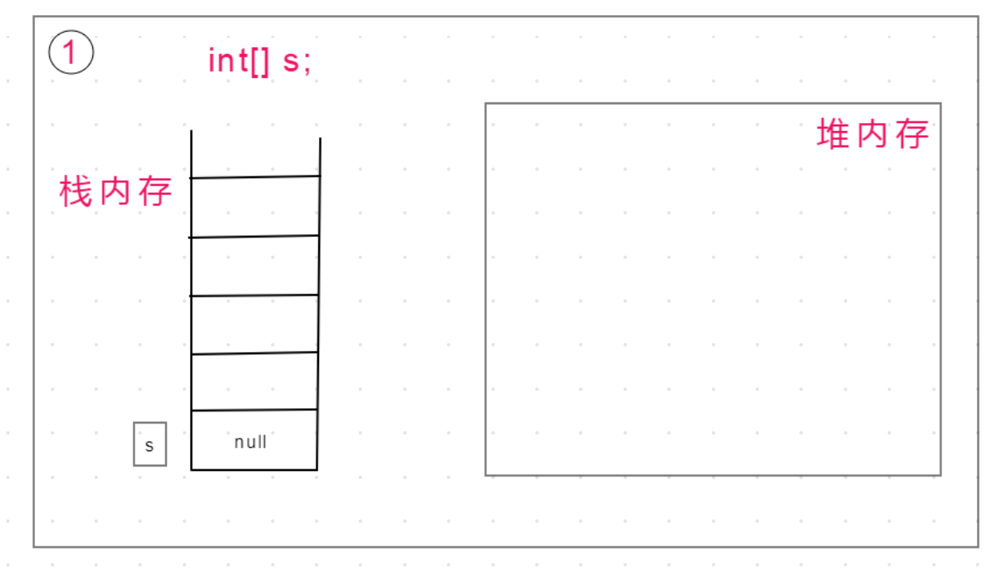
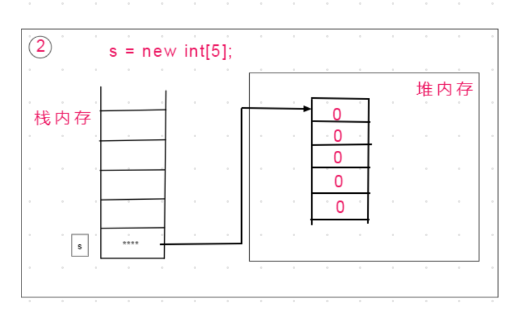
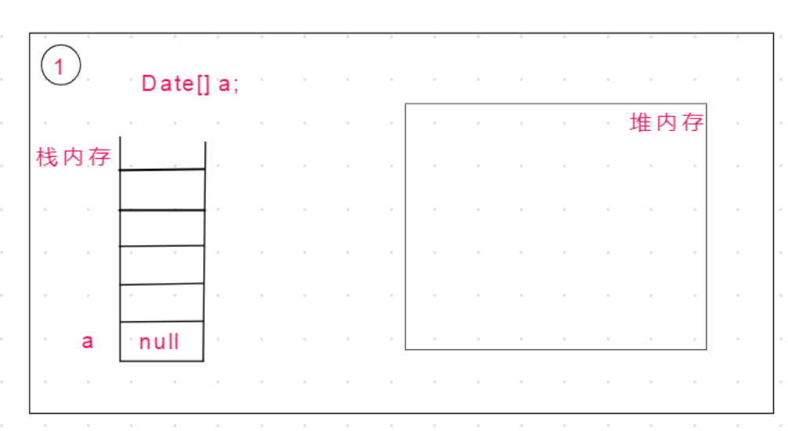
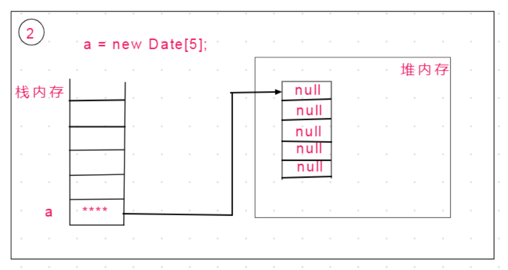
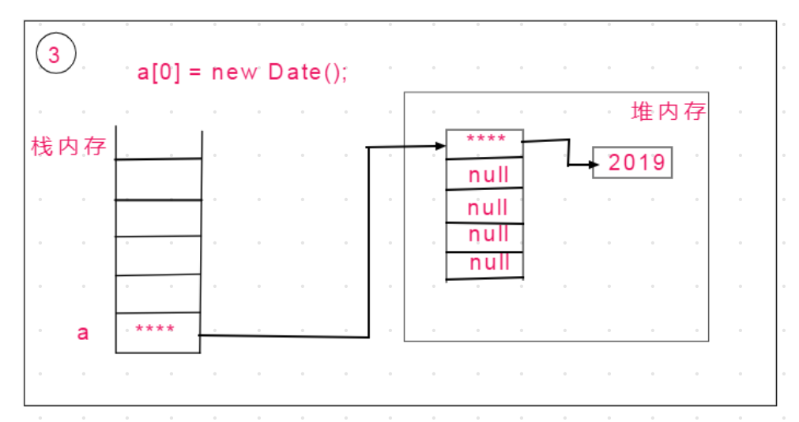
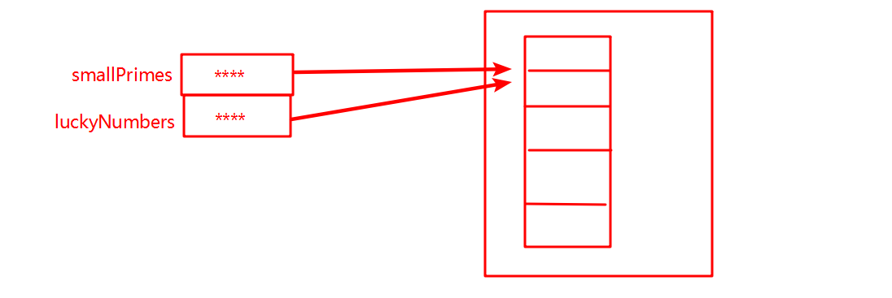
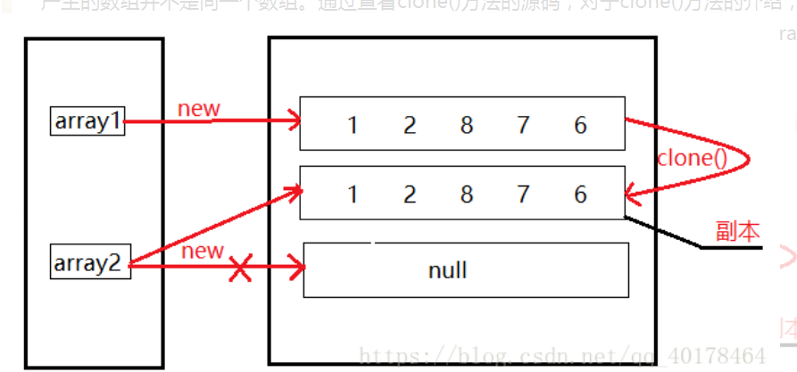
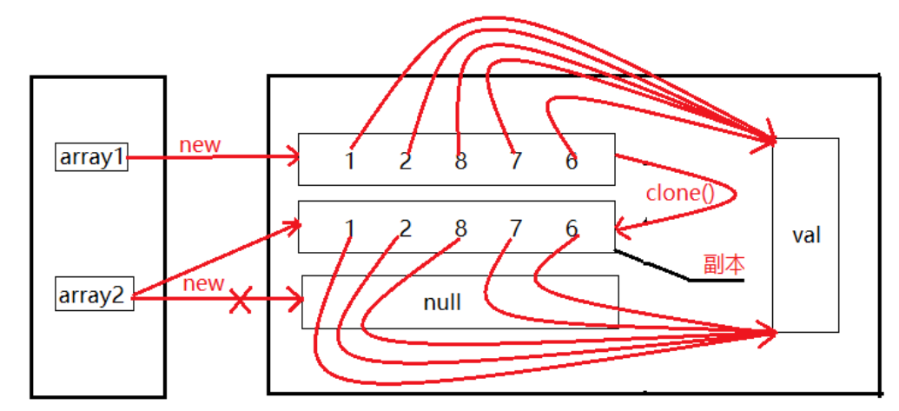

# Array数组

## 一、声明方式

```java
int[] a;
int b[];
```

- 声明数组时不能指定其长度

## 二、初始化

### 2.1动态初始化

数组定义与为元素分配空间和初始化分开操作

```java
int[] a;
a = new int[3];
```

### 2.2静态初始化

数组定义的同时为数组分配空间和初始化

```java
int[] a = {1,2,3}
```

## 三、数组对象的创建

### 3.1元素为基本数据类型





### 3.2元素为引用类型







## 四、数组拷贝

### 4.1两个变量引用同一个数组

```java
 int[] smallPrimes = {2,3,4,5};
 int[] luckyNumber = smallPrimes;
 luckyNumber[1] = 99;
 smallPrimes[0] = 1;
 System.out.println(Arrays.toString(smallPrimes));
 System.out.println(Arrays.toString(luckyNumber));
//[1, 99, 4, 5]
//[1, 99, 4, 5]
```



### 4.2clone 方法

#### 4.21基本数据类型+String

- 深拷贝

```java

    public static void main(String[] args) {

        int[] array1 = new int[]{1, 2, 8, 7, 6};
        int[] array2 = new int[array1.length];
        array2 = array1.clone();

        System.out.println("array1 = " + Arrays.toString(array1));
        System.out.println("array2 = " + Arrays.toString(array2));
        System.out.println("======================");

        array2[0] = 100;
        System.out.println("array1 = " + Arrays.toString(array1));
        System.out.println("array2 = " + Arrays.toString(array2));
    }

    //array1 = [1, 2, 8, 7, 6]
    //array2 = [1, 2, 8, 7, 6]
    //======================
    //array1 = [1, 2, 8, 7, 6]
    //array2 = [100, 2, 8, 7, 6]
```



#### 4.22引用类型

- 浅拷贝

  ```java
  Employee[] employees1 = {new Employee("name",12)};
  Employee[] employees2 = employees1.clone();
  employees1[0].setName("name2");
  System.out.println(employees1[0]);
  System.out.println(employees2[0]);
  ```

