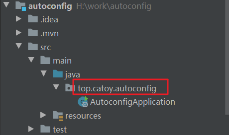

### SpringBoot项目如何扫描各个模块的包

1） `@SpringBootApplication`默认扫描与启动类所在的包名下的所有类，包括子类中同名包下的所有类。




第一个图为启动工程的目录结构，启动类所在的包名为`top.catoy.autoconfig`,因此启动工程中在此包下的所有配置类都会被扫描到。在子工程`autoconfig-service`中，有两个子包`top.catoy.autoconfig`、`top.catoy.autoconfigservice`,此时只有第一个包下的配置类会被扫描到，因此第二个包中的配置无法被加进容器里。

2）在启动工程中定义需要扫描的包

```java
@SpringBootApplication(scanBasePackages = {"com.singlee", ...}, exclude = {FlywayAutoConfiguration.class,...})
```

3） 在启动类中使用`@Import`手动导入一个配置类

```
@Import(ServiceConfig.class)
```

4） 使用@Enable...自定义注解。实际上只是包装了@Import，如果我们有一个模块是由多个配置类组成，这种办法是一种将这些配置类聚合到单个模块中的方便且富有表现力的方法。

- 首先增加一个注解类

  ```java
  @Retention(RetentionPolicy.RUNTIME)
  @Target({ElementType.TYPE})
  @Documented
  @Import(ServiceConfig.class)
  @Configuration
  public @interface EnableServiceConfig {
  }
  ```

- 在启动类上增加自定义的注解

  ```java
  @SpringBootApplication
  @EnableServiceConfig
  public class AutoconfigApplication {
      public static void main(String[] args) {
          SpringApplication.run(AutoconfigApplication.class, args);
      }
  
  }
  ```

4） 使用springboot的auto-config方式

- 在启动项目的classPath下增加一个`META-INF`目录。在目录中增加一个`spring.factories`文件。文件中配置如下

  ```java
  # Auto Configure
  org.springframework.boot.autoconfigure.EnableAutoConfiguration=\
  top.catoy.autoconfigservice.config.ServiceConfig
  ```

  这样springboot启动时就会去扫描这个配置类了。

- 在`top.catoy.autoconfigservice.config.ServiceConfig`配置类中怎加条件注解

  ```java
  @Configuration
  @ConditionalOnProperty(name = "top.catoy.autoconfigservice.config.ServiceConfig.enable", havingValue = "true", matchIfMissing = false)
  public class ServiceConfig {
      @Bean
      public Persion setPersion() {
          Persion persion = new Persion();
          persion.setAge("1");
          persion.setName("小明");
          return persion;
      }
  }
  ```

  这样在`application.properties`中配置`top.catoy.autoconfigservice.config.ServiceConfig.enable`这个参数就可以开启或关闭是否导入该配置了。

### 如何不注入某些包下的配置类

1） 当使用`@ComponentScan`注解指定扫描的包时，在`scanBasePackages`中设置`excludeFilters`

```
@ComponentScan(value = "com.aw.phjr", excludeFilters = @ComponentScan.Filter(type = FilterType.ASSIGNABLE_TYPE, classes = {RedisConfiguration.class, RedisUtil.class}))
```

2） 给配置类中增加条件注解

```java
@ConditionalOnProperty(name="top.catoy.autoconfig.enable",havingValue = "true",matchIfMissing = false)
```

只要在application.properties中设置`top.catoy.autoconfig.enable=true`则该配置类才会被扫描到