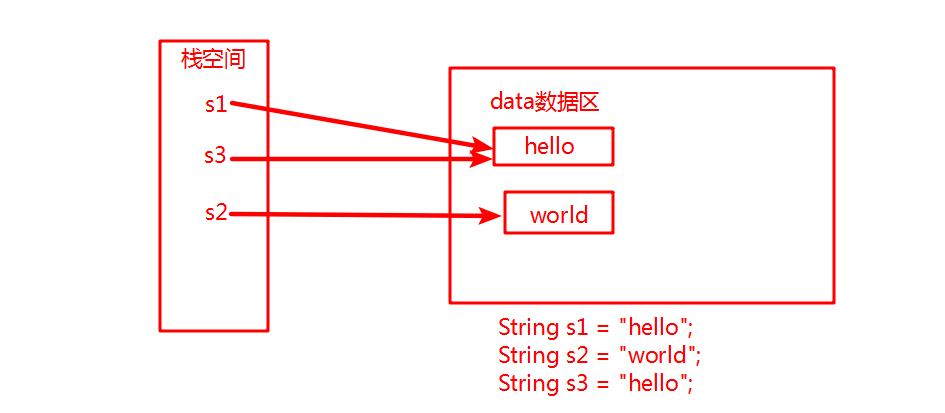
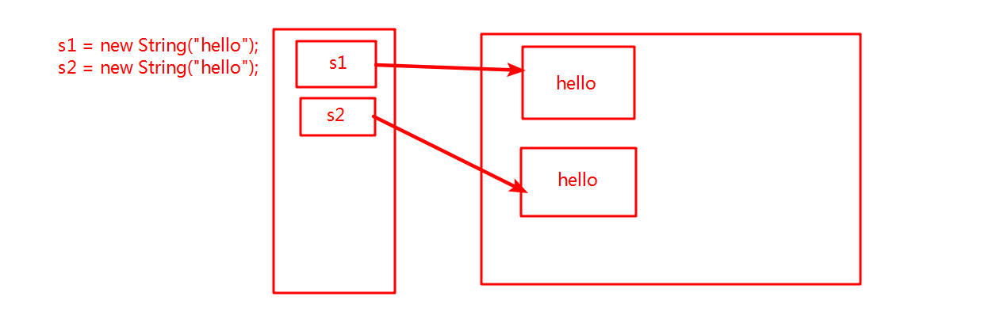
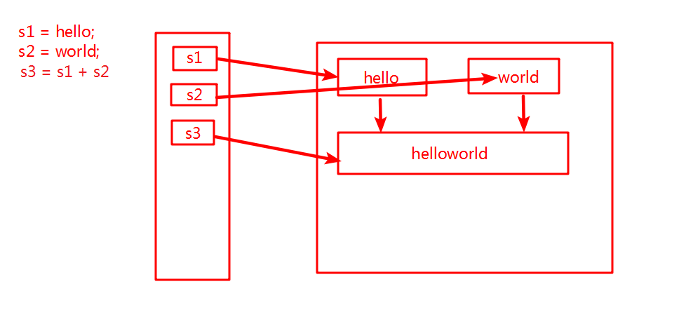

# String、StringBuffer、StringBuider

## String(不可变字符串)

- 这里s1==s3,因为指向同一个值



- s1==s2//false;       s1.equals(s2)//true

  

- 

## StringBuffer

- 线程安全
- 可变的字符串序列

#### 练习

```java
public class Test18 {
    public static void main(String[] args){
        String s = "Mircosoft";
        char[] a = {'a','b','c'};
        StringBuffer sb1 = new StringBuffer(s);
        sb1.append('/').append('3');
        System.out.println(sb1);//Mircosoft/3
        StringBuffer sb2 = new StringBuffer("数字");
        for(int i=0;i<9;i++){
            sb2.append(i);
        }
        System.out.println(sb2);//数字012345678
        sb2.delete(8,sb2.length());
        System.out.println(sb2);//数字012345
        sb2.insert(0,a);
        System.out.println(sb2);//abc数字012345
        System.out.println(sb2.reverse());//543210字数cba
    }
}
```


## StringBuider

- 可变的字符串序列

- 前身是StringBuffer

- 线程不安全

- 当需要多个小段的字符串构建一个字符串时可以用

  ```java
   StringBuilder builder = new StringBuilder();
   builder.append("小");
   builder.append('明');
   builder.append(1);
   System.out.println(builder.toString());
  ```

## 

