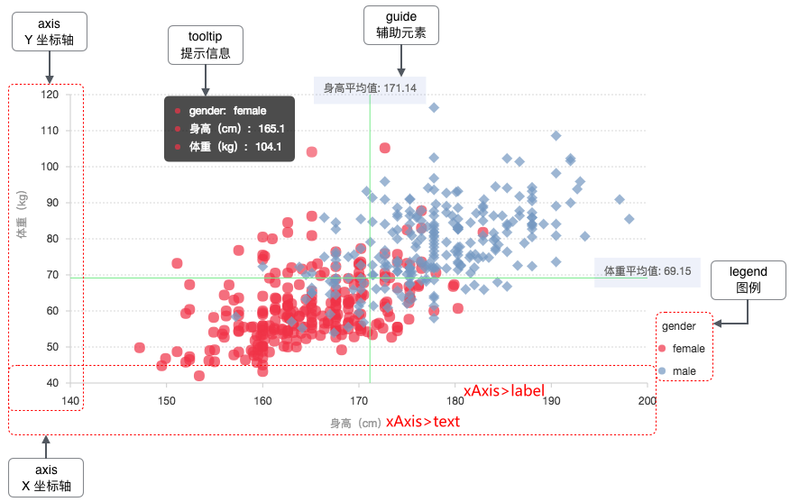

## 图表组成



https://antv.vision/old-site/g2/doc/tutorial/start/index.html

## 常用配置

```javascript
const config = {
    data,
    padding: '240',
    xField: 'Date',
    yField: 'scales',
   lineStyle: {
    lineWidth: 2,
    stroke: 'rgba(0, 0, 0, 0.8)',
  },
  point: {
    shape: 'circle',
    size: 3,
    style: {
      fill: 'white',
      stroke: 'rgba(0, 0, 0, 0.8)',
      lineWidth: 1,
    },
  },
  legend: {
    position: 'top',
  },
  tooltip: {
    formatter: (datum) => {
      return { 
         name: datum.category, 
         value: datum.value + '%'
      };
    },
    title:'year',
  },
  xAxis: {
    title: {
      text: '年份',
    },
    label:{
      formatter: (v) => {
        return v + '年'
      }
    }
  },
  yAxis: {
    title: {
      text: '销售额/利润',
    },
  },
 };
```

