## eclipse使用svn

### 一、解决冲突

> #### 本地与远程仓库代码进行比较，产看是否有冲突

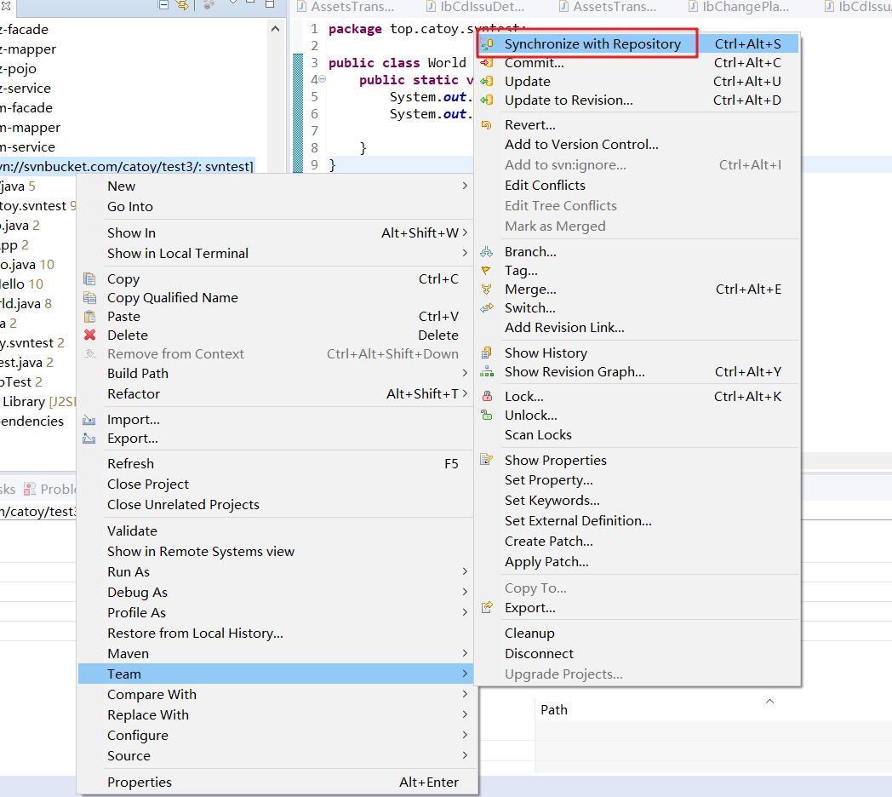

> #### 展示本地和远程仓库出现不同的代码

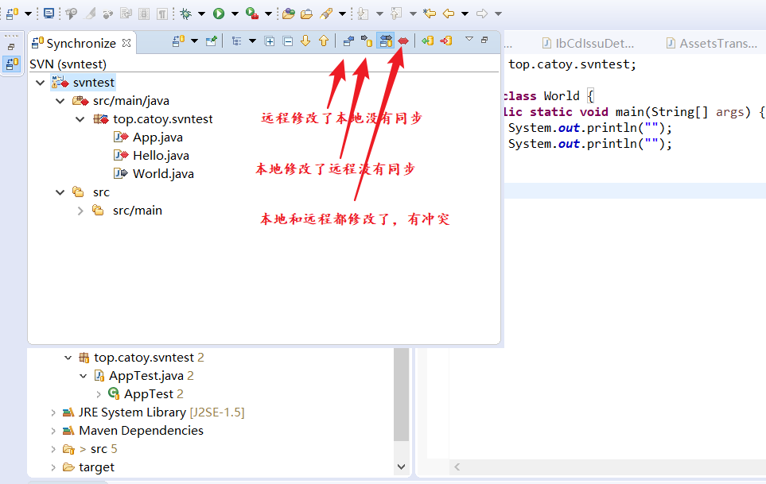

> #### 双击文件出现代码比对框

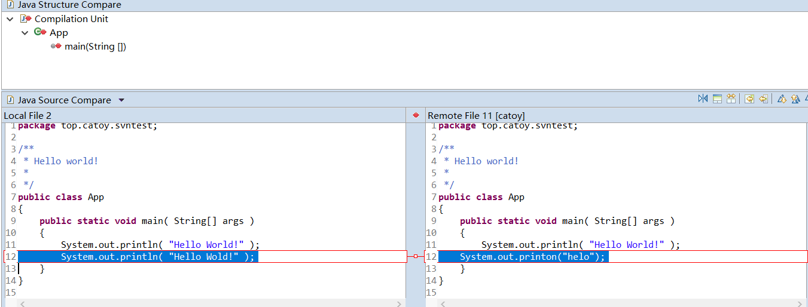

### 二、忽略某些文件

### 三、eclipse check out

> #### 选择导入

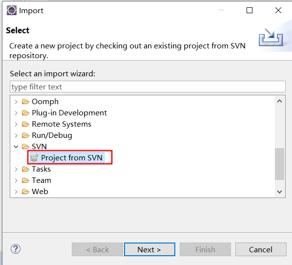

> #### 将资源作为项目导入

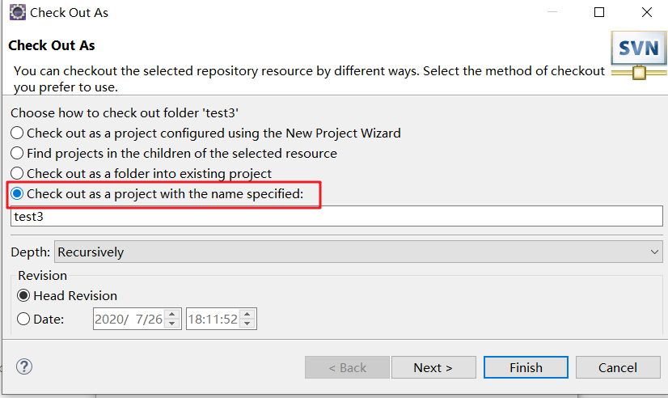

> #### 将项目转化未maven项目

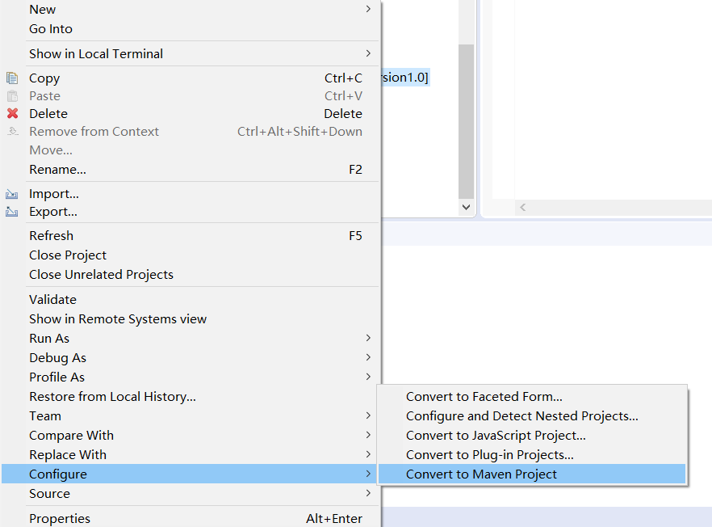

### 四、新建分支

#### 1.从trunk创建分支

> #### 选择远程仓库

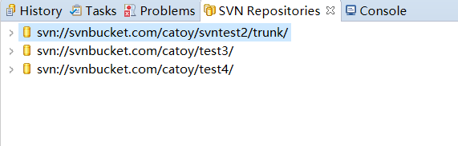

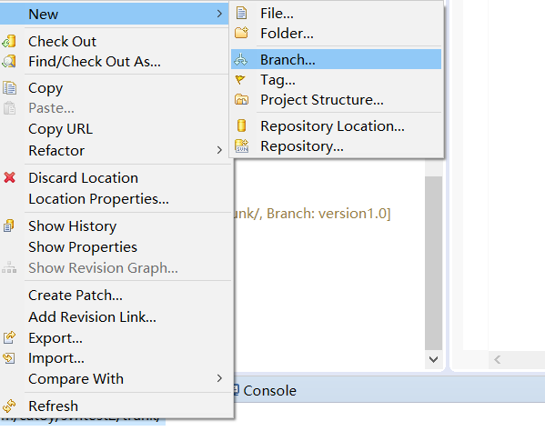

#### 2.从分支创建分支

> #### 选中某个分支右键

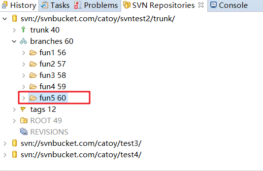

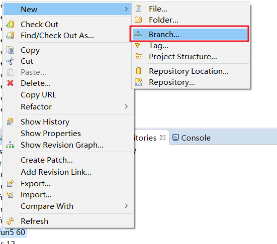

### 五、将某个分支的代码合并到某个分支

> 首先提交代码，避免代码丢失

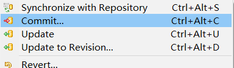

> 点击merge

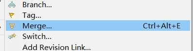

> 选择需要合过来的分支

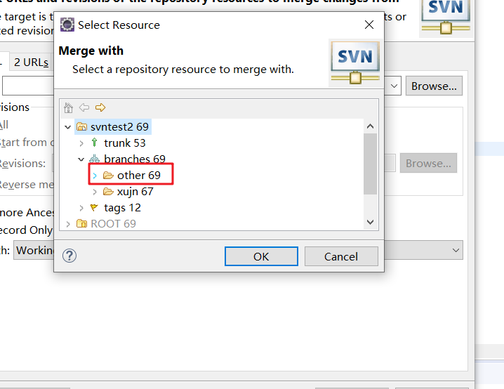

> 选择需要合并的版本

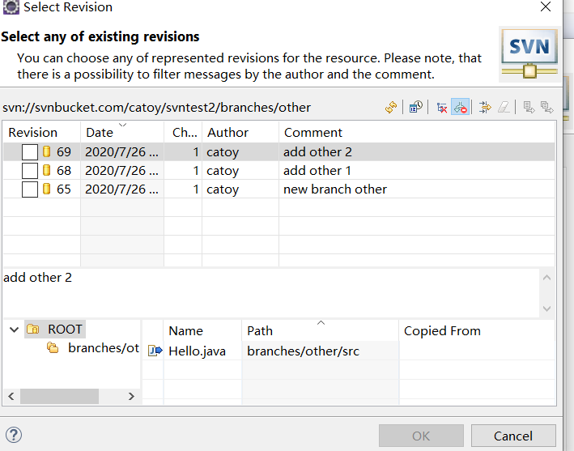

> 查看有冲突的文件

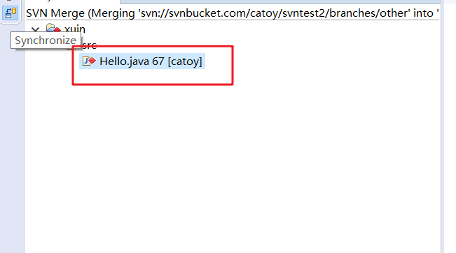

> 解决冲突

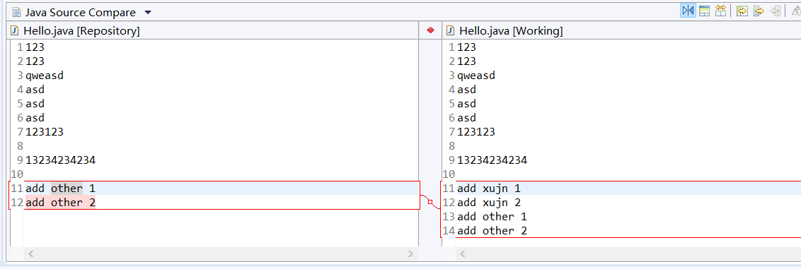

> 标记为已解决

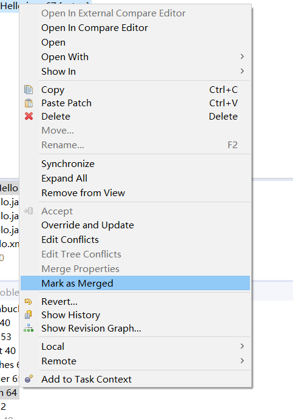

### 六、切换分支

> 首先提交一下代码，避免代码丢失

> 切换分支

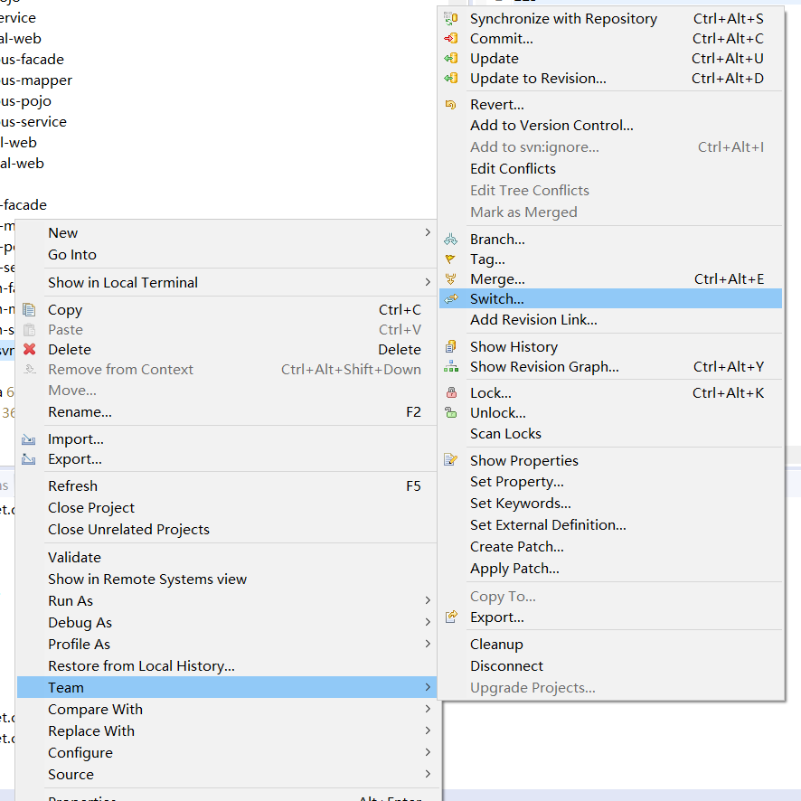