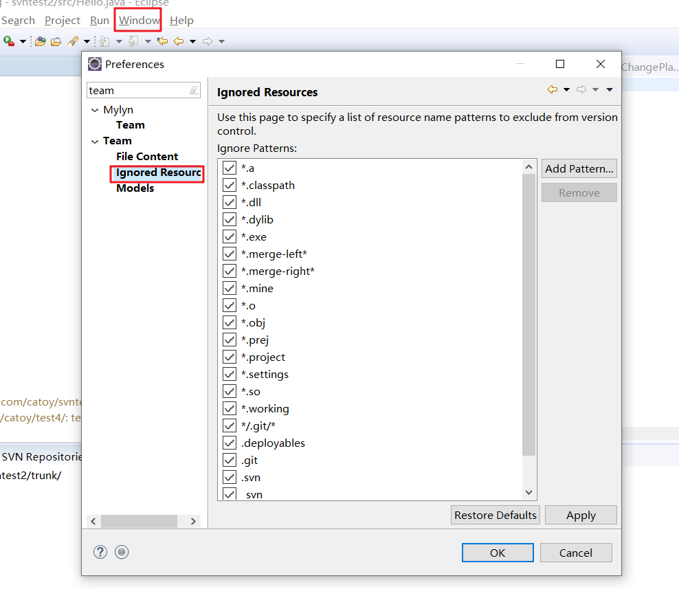

## eclipse使用svn

### 一、解决冲突

> #### 本地与远程仓库代码进行比较，产看是否有冲突

> #### 展示本地和远程仓库出现不同的代码

> #### 双击文件出现代码比对框

### 二、忽略某些文件

### 三、eclipse check out

> #### 选择导入

> #### 将资源作为项目导入

> #### 将项目转化未maven项目

### 四、新建分支

#### 1.从trunk创建分支

> #### 选择远程仓库

#### 2.从分支创建分支

> #### 选中某个分支右键

### 五、将某个分支的代码合并到某个分支

> 首先提交代码，避免代码丢失

> 点击merge

> 选择需要合过来的分支

> 选择需要合并的版本

> 查看有冲突的文件

> 解决冲突

> 标记为已解决

### 六、切换分支

> 首先提交一下代码，避免代码丢失

> 切换分支

