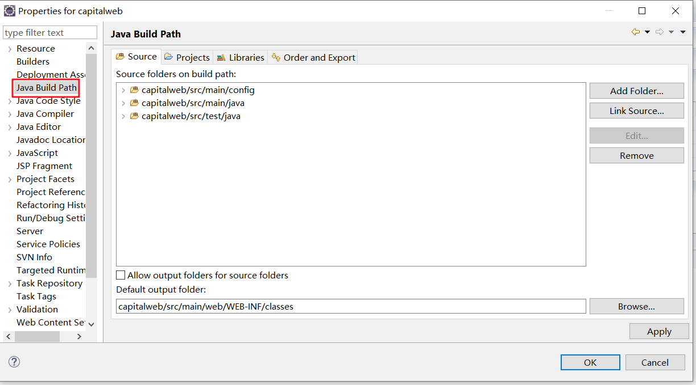
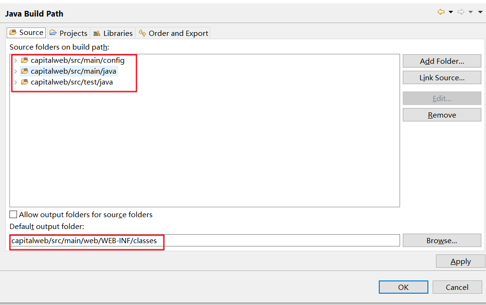
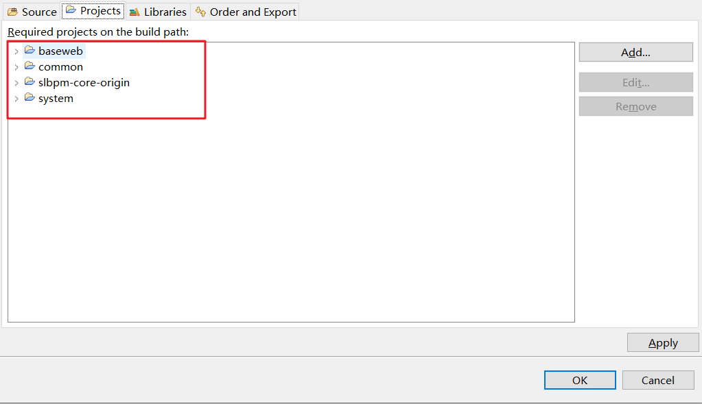
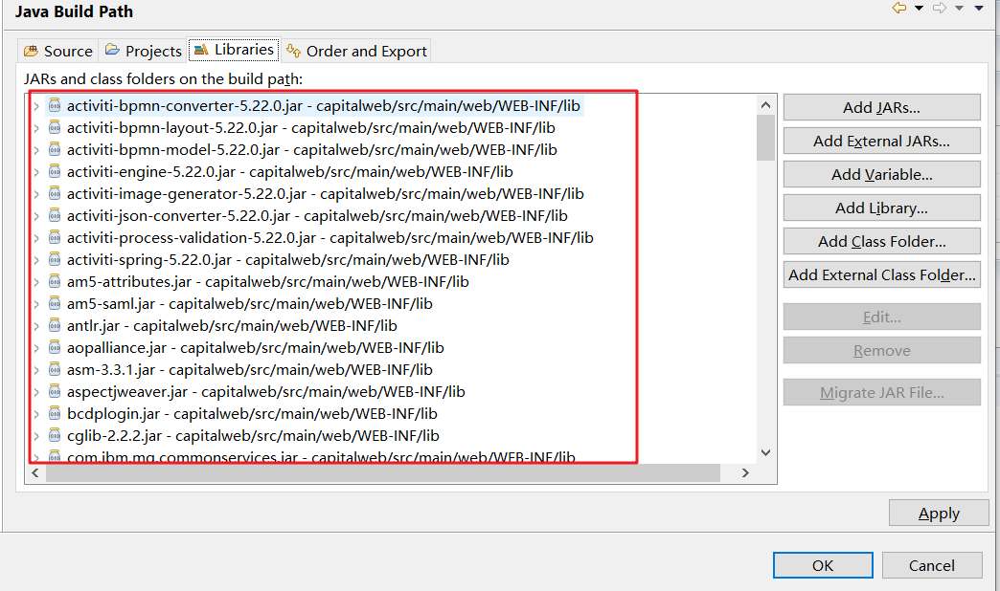
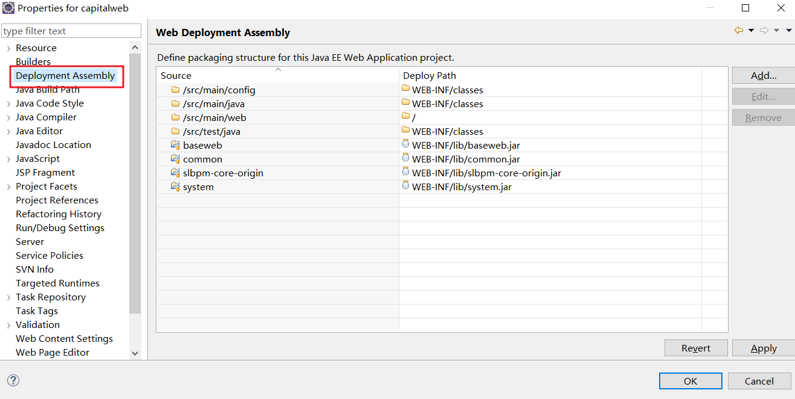
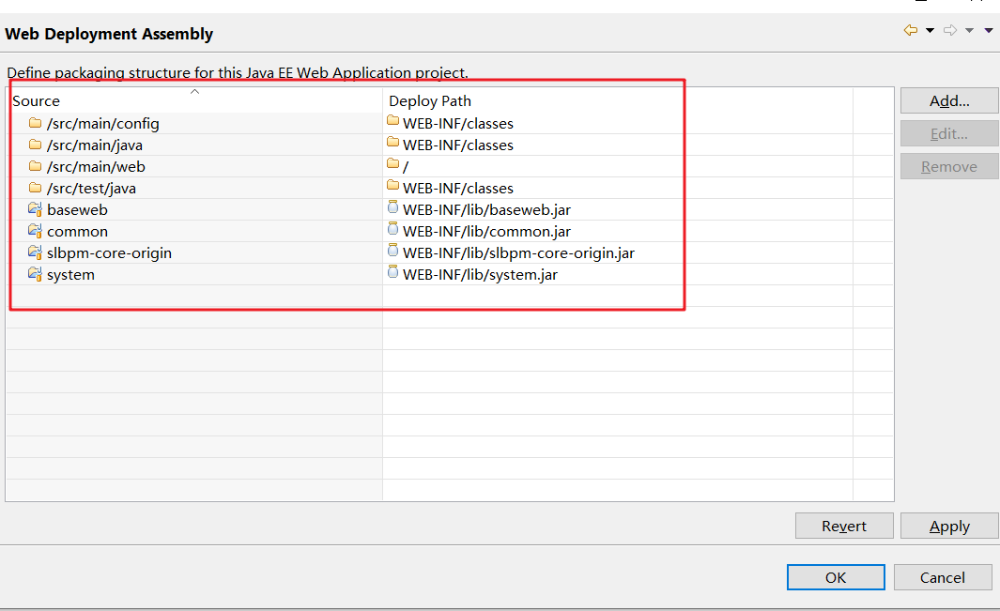
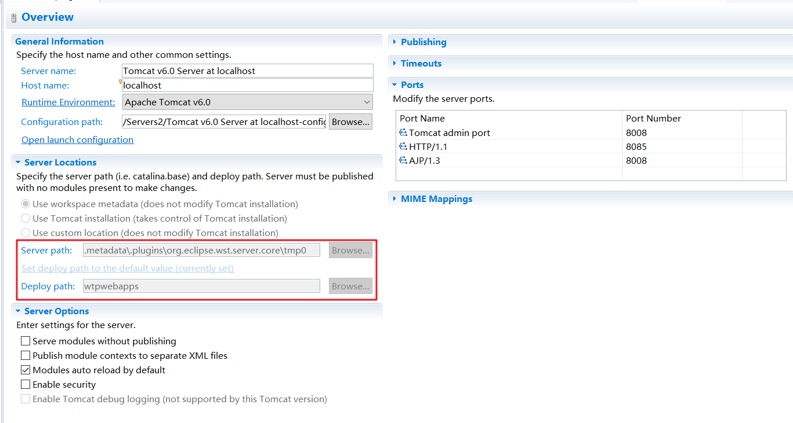

## eclipse 使用tomcat部署一个web项目

> #### 一、配置编译参数

打开项目配置的build path

配置需要编译的目录和编译输出目录

选择该项目需要依赖的其他项目

选择项目需要依赖的第三方jar文件

order and export 

**TODO**

> #### 二、配置发布参数

打开项目配置的Deployment Assembly

配置需要复制到tomcat目录的文件目录，赋值过去的是已经编译好的class文件和其他配置文件

tomcat的运行目录可以在配置文件中 配置

