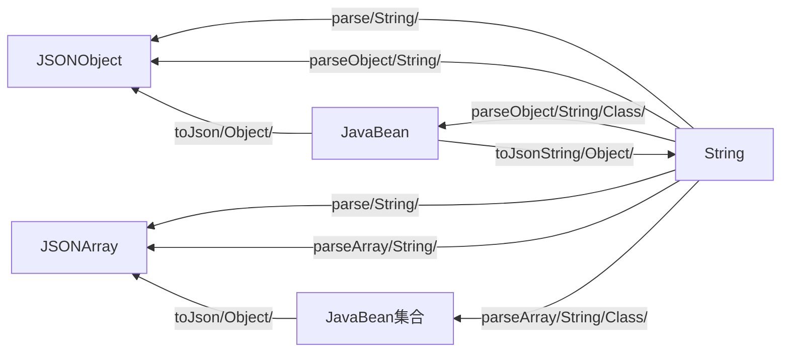

# JSON数据处理

## 一、fastJson




```java
public static final Object parse(String text); // 把JSON文本parse为JSONObject或者JSONArray 
public static final JSONObject parseObject(String text)； // 把JSON文本parse成JSONObject    
public static final <T> T parseObject(String text, Class<T> clazz); // 把JSON文本parse为JavaBean 
public static final JSONArray parseArray(String text); // 把JSON文本parse成JSONArray 
public static final <T> List<T> parseArray(String text, Class<T> clazz); //把JSON文本parse成JavaBean集合 
public static final String toJSONString(Object object); // 将JavaBean序列化为JSON文本 
public static final String toJSONString(Object object, boolean prettyFormat); // 将JavaBean序列化为带格式的JSON文本 
public static final Object toJSON(Object javaObject); //将JavaBean转换为JSONObject或JSONArray。
```

##### exp

```java
public class FastJsonExp {
    @Test
    /**
     * javaBean --> String
     */
    public void javaBeanToString(){
        Student student = new Student();
        student.setPassword("123");
        student.setName("小明");
        String jsonStr = JSON.toJSONString(student);
        System.out.println(jsonStr);
    }

    /**
     * String --> javaBean
     */
    @Test
    public void stringToJavaBean(){
        String jsonStr = "{\"name\":\"小明\",\"password\":\"123\"}";
        Student student = JSON.parseObject(jsonStr,Student.class);
        System.out.println(student.toString());
    }
   
  @Test
    /**
     * List --> JSONArray
     */
    public void ListToJSONArray(){
        List<Student> students  = new ArrayList();
        Student student = new Student();
        Student student1 = new Student();
        student.setName("a");
        student.setPassword("234e");
        student1.setName("b");
        student1.setPassword("234");
        students.add(student);
        students.add(student1);
        JSONArray jsonArray = (JSONArray)JSONArray.toJSON(students);
        System.out.println(jsonArray);
    }

    /**
     * String --> List
     */
    @Test
    public void stringToListOrArray(){
        String jsonStr = "[{\"name\":\"mac\",\"password\":\"123\"},	  		         {\"name\":\"lisa\",\"password\":\"234\"}]";
        List<Student> list = JSON.parseArray(jsonStr,Student.class);
        for(Student s:list){
            System.out.println(s.toString());
        }
    }
```


##### 高级

@JSONField(name="TrackContent")

#### todo


## 二、gson

#### todo

## 三、jsonlib

[各种转换]: http://json-lib.sourceforge.net/snippets.html

##### exp

```java
public class jsonlibExp {
    @Test
    /**
     * java对象 --> JSONArray & JSONObject
     */
    public void javaObjToJSONArrayOrJSONObject(){
        //list to JSONArray
        List<String> list = new ArrayList();
        list.add("one");
        list.add("two");
        list.add("three");
        JSONArray jsonArray = JSONArray.fromObject(list);
        System.out.println(jsonArray);

        //String to JSONArray
        String s = "[1,2,3]";
        JSONArray jsonArray1 = JSONArray.fromObject(s);
        System.out.println(jsonArray1);

        //String to JSONObject
        String s1 = "{\"name\":\"小明\",\"password\":\"123\"}";
        JSONObject jsonObject = JSONObject.fromObject(s1);
        System.out.println(jsonObject);

        //Array to JSONArray
        boolean[] booleans = new boolean[]{true,false,false};
        JSONArray jsonArray2 = JSONArray.fromObject(booleans);
        System.out.println(jsonArray2);
    }

    /**
     * javaBean & Map --> JSONObject
     */
    @Test
    public void beanOrMapToJSONObject(){
        //Map to JSONObject
        Map<String,String> map = new HashMap();
        map.put("name","小明");
        map.put("password","234");
        JSONObject jsonObject = JSONObject.fromObject(map);
        System.out.println(jsonObject);

        //javaBean to JSONObject
        Student student = new Student();
        student.setName("小明");
        student.setPassword("123");
        JSONObject jsonObject1 = JSONObject.fromObject(student);
        System.out.println(jsonObject1);
    }
}
```