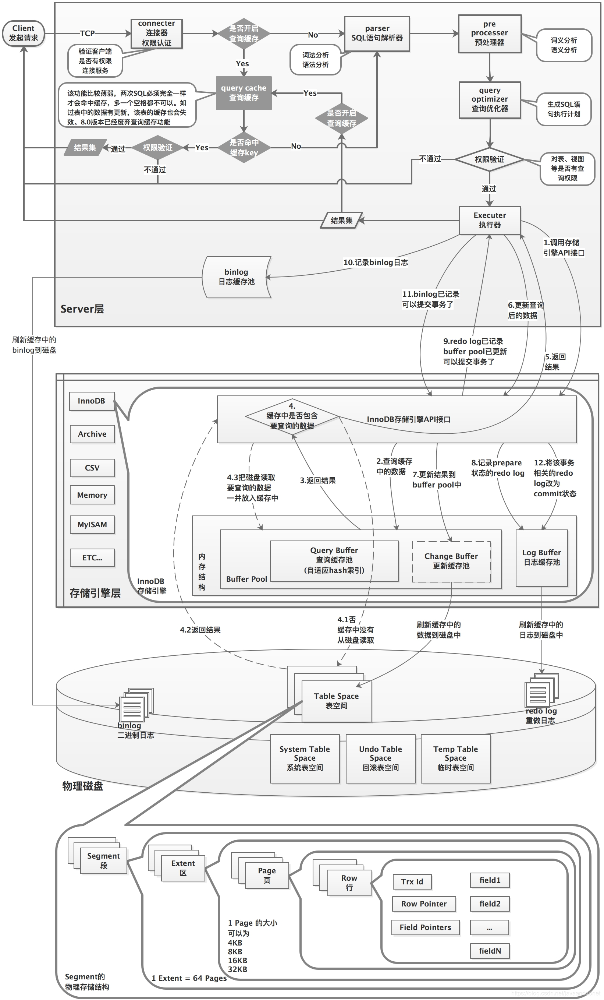

## 一、mysql的启动和关闭

在安装目录的support-files里有个mysql.server脚本，可以控制mysql的启动和关闭

- mysql.server start 启动
- mysql.server stop 关闭

## 二、账户管理

- 密码强度设置

  ```sql
  set global validate_password.policy=0;//密码等级
  set global validate_password.length=1;//密码允许最短长度
  ```

  

- 创建账户

  ```sql
  create user 'xxx'@'xxx' identified by 'password';
  ```

- 权限分配

  ```sql
  grant select,update,delete,insert on test.* to 'catoy'@'%';//给catoy用户赋予test库所有表的增删改查权限
  grant select on test.* to 'catoy'@'%';//给catoy用户赋予test库所有表的只读权限
revoke all on *.* from 'catoy'@'%';//撤销catoy对所有数据库的所有权限
  show grants;//现实当前用户的权限
  ```


## 三、字符集管理

- 显示当前字符集规则设置

  ```sql
  show variables like 'character\_set\_%';
  ```

  

- 设置字符集编码

  ```sql
  set names 'utf8';//等价于下列三句话
  
  set character_set_client = utf8;
  set character_set_results = utf8;
  set character_set_connection = utf8;
  
  
  ```


## 四、配置管理


## 五、EXPLAIN 

EXPLAIN :模拟Mysql优化器是如何执行SQL查询语句的，从而知道Mysql是如何处理你的SQL语句的。分析你的查询语句或是表结构的性能瓶颈。

```
mysql> explain select * from tb_user;
+----+-------------+---------+------+---------------+------+---------+------+------+-------+
| id | select_type | table   | type | possible_keys | key  | key_len | ref  | rows | Extra |
+----+-------------+---------+------+---------------+------+---------+------+------+-------+
|  1 | SIMPLE      | tb_user | ALL  | NULL          | NULL | NULL    | NULL |    1 | NULL  |
+----+-------------+---------+------+---------------+------+---------+------+------+-------+
```

**(一)id列：**

[](javascript:void(0);)

```
(1)、id 相同执行顺序由上到下
mysql> explain  
    -> SELECT*FROM tb_order tb1
    -> LEFT JOIN tb_product tb2 ON tb1.tb_product_id = tb2.id
    -> LEFT JOIN tb_user tb3 ON tb1.tb_user_id = tb3.id;
+----+-------------+-------+--------+---------------+---------+---------+---------------------------+------+-------+
| id | select_type | table | type   | possible_keys | key     | key_len | ref                       | rows | Extra |
+----+-------------+-------+--------+---------------+---------+---------+---------------------------+------+-------+
|  1 | SIMPLE      | tb1   | ALL    | NULL          | NULL    | NULL    | NULL                      |    1 | NULL  |
|  1 | SIMPLE      | tb2   | eq_ref | PRIMARY       | PRIMARY | 4       | product.tb1.tb_product_id |    1 | NULL  |
|  1 | SIMPLE      | tb3   | eq_ref | PRIMARY       | PRIMARY | 4       | product.tb1.tb_user_id    |    1 | NULL  |
+----+-------------+-------+--------+---------------+---------+---------+---------------------------+------+-------+

(2)、如果是子查询，id序号会自增，id值越大优先级就越高，越先被执行。
mysql> EXPLAIN
    -> select * from tb_product tb1 where tb1.id = (select tb_product_id from  tb_order tb2 where id = tb2.id =1);
+----+-------------+-------+-------+---------------+---------+---------+-------+------+-------------+
| id | select_type | table | type  | possible_keys | key     | key_len | ref   | rows | Extra       |
+----+-------------+-------+-------+---------------+---------+---------+-------+------+-------------+
|  1 | PRIMARY     | tb1   | const | PRIMARY       | PRIMARY | 4       | const |    1 | NULL        |
|  2 | SUBQUERY    | tb2   | ALL   | NULL          | NULL    | NULL    | NULL  |    1 | Using where |
+----+-------------+-------+-------+---------------+---------+---------+-------+------+-------------+
(3)、id 相同与不同，同时存在

mysql> EXPLAIN 
    -> select * from(select * from tb_order tb1 where tb1.id =1) s1,tb_user tb2 where s1.tb_user_id = tb2.id;
+----+-------------+------------+--------+---------------+---------+---------+-------+------+-------+
| id | select_type | table      | type   | possible_keys | key     | key_len | ref   | rows | Extra |
+----+-------------+------------+--------+---------------+---------+---------+-------+------+-------+
|  1 | PRIMARY     | <derived2> | system | NULL          | NULL    | NULL    | NULL  |    1 | NULL  |
|  1 | PRIMARY     | tb2        | const  | PRIMARY       | PRIMARY | 4       | const |    1 | NULL  |
|  2 | DERIVED     | tb1        | const  | PRIMARY       | PRIMARY | 4       | const |    1 | NULL  |
+----+-------------+------------+--------+---------------+---------+---------+-------+------+-------+
derived2：衍生表   2表示衍生的是id=2的表 tb1
```

[](javascript:void(0);)

**（二）select_type列：数据读取操作的操作类型**
　　1、SIMPLE:简单的select 查询，SQL中不包含子查询或者UNION。
　　2、PRIMARY:查询中包含复杂的子查询部分，最外层查询被标记为PRIMARY
　　3、SUBQUERY:在select 或者WHERE 列表中包含了子查询
　　4、DERIVED:在FROM列表中包含的子查询会被标记为DERIVED(衍生表)，MYSQL会递归执行这些子查询，把结果集放到零时表中。
　　5、UNION:如果第二个SELECT 出现在UNION之后，则被标记位UNION；如果UNION包含在FROM子句的子查询中，则外层SELECT 将被标记为DERIVED
　　6、UNION RESULT:从UNION表获取结果的select

**（三）table列：该行数据是关于哪张表**

**（四）type列：访问类型  由好到差system > const > eq_ref > ref > range > index > ALL**

　　1、system:表只有一条记录(等于系统表),这是const类型的特例，平时业务中不会出现。
　　2、const:通过索引一次查到数据，该类型主要用于比较primary key 或者unique 索引，因为只匹配一行数据，所以很快;如果将主键置于WHERE语句后面，Mysql就能将该查询转换为一个常量。
　　3、eq_ref:唯一索引扫描，对于每个索引键，表中只有一条记录与之匹配。常见于主键或者唯一索引扫描。
　　4、ref:非唯一索引扫描，返回匹配某个单独值得所有行，本质上是一种索引访问，它返回所有匹配某个单独值的行，就是说它可能会找到多条符合条件的数据，所以他是查找与扫描的混合体。

　　详解：这种类型表示mysql会根据特定的算法快速查找到某个符合条件的索引，而不是会对索引中每一个数据都进行一 一的扫描判  断，也就是所谓你平常理解的使用索引查询会更快的取出数据。而要想实现这种查找，索引却是有要求的，要实现这种能快速查找的算法，索引就要满足特定的数据结构。简单说，也就是索引字段的数据必须是有序的，才能实现这种类型的查找，才能利用到索引。

　　5、range：只检索给定范围的行，使用一个索引来选着行。key列显示使用了哪个索引。一般在你的WHERE 语句中出现between 、< 、> 、in 等查询，这种给定范围扫描比全表扫描要好。因为他只需要开始于索引的某一点，而结束于另一点，不用扫描全部索引。
　　6、index：FUll Index Scan 扫描遍历索引树(index：这种类型表示是mysql会对整个该索引进行扫描。要想用到这种类型的索引，对这个索引并无特别要求，只要是索引，或者某个复合索引的一部分，mysql都可能会采用index类型的方式扫描。但是呢，缺点是效率不高，mysql会从索引中的第一个数据一个个的查找到最后一个数据，直到找到符合判断条件的某个索引）。`select id from emp`

　　7、ALL 全表扫描 从磁盘中获取数据 百万级别的数据ALL类型的数据尽量优化。

**（五）possible_keys列:**显示可能应用在这张表的索引，一个或者多个。查询涉及到的字段若存在索引，则该索引将被列出，但不一定被查询实际使用。
**（六）keys列:**实际使用到的索引。如果为NULL，则没有使用索引。查询中如果使用了覆盖索引，则该索引仅出现在key列表中。覆盖索引：select 后的 字段与我们建立索引的字段个数一致。

**（七）ken_len列:**表示索引中使用的字节数，可通过该列计算查询中使用的索引长度。在不损失精确性的情况下，长度越短越好。key_len 显示的值为索引字段的最大可能长度，并非实际使用长度，即key_len是根据表定义计算而得，不是通过表内检索出来的。
**（八）ref列**:显示索引的哪一列被使用了，如果可能的话，是一个常数。哪些列或常量被用于查找索引列上的值。
**（九）rows列(每张表有多少行被优化器查询)**:根据表统计信息及索引选用的情况，大致估算找到所需记录需要读取的行数。

**（十）Extra列：扩展属性，但是很重要的信息。**

```
 1、 Using filesort(文件排序)：mysql无法按照表内既定的索引顺序进行读取。
 mysql> explain select order_number from tb_order order by order_money;
+----+-------------+----------+------+---------------+------+---------+------+------+----------------+
| id | select_type | table    | type | possible_keys | key  | key_len | ref  | rows | Extra          |
+----+-------------+----------+------+---------------+------+---------+------+------+----------------+
|  1 | SIMPLE      | tb_order | ALL  | NULL          | NULL | NULL    | NULL |    1 | Using filesort |
+----+-------------+----------+------+---------------+------+---------+------+------+----------------+
1 row in set (0.00 sec)
说明：order_number是表内的一个唯一索引列，但是order by 没有使用该索引列排序，所以mysql使用不得不另起一列进行排序。
2、Using temporary:Mysql使用了临时表保存中间结果，常见于排序order by 和分组查询 group by。

mysql> explain select order_number from tb_order group by order_money;
+----+-------------+----------+------+---------------+------+---------+------+------+---------------------------------+
| id | select_type | table    | type | possible_keys | key  | key_len | ref  | rows | Extra                           |
+----+-------------+----------+------+---------------+------+---------+------+------+---------------------------------+
|  1 | SIMPLE      | tb_order | ALL  | NULL          | NULL | NULL    | NULL |    1 | Using temporary; Using filesort |
+----+-------------+----------+------+---------------+------+---------+------+------+---------------------------------+
1 row in set (0.00 sec)
3、Using index 表示相应的select 操作使用了覆盖索引，避免访问了表的数据行，效率不错。
如果同时出现Using where ，表明索引被用来执行索引键值的查找。
如果没有同时出现using where 表明索引用来读取数据而非执行查找动作。
mysql> explain select order_number from tb_order group by order_number;
+----+-------------+----------+-------+--------------------+--------------------+---------+------+------+-------------+
| id | select_type | table    | type  | possible_keys      | key                | key_len | ref  | rows | Extra       |
+----+-------------+----------+-------+--------------------+--------------------+---------+------+------+-------------+
|  1 | SIMPLE      | tb_order | index | index_order_number | index_order_number | 99      | NULL |    1 | Using index |
+----+-------------+----------+-------+--------------------+--------------------+---------+------+------+-------------+
1 row in set (0.00 sec)

4、Using where 查找
5、Using join buffer ：表示当前sql使用了连接缓存。
6、impossible where ：where 字句 总是false ，mysql 无法获取数据行。
7、select tables optimized away：
8、distinct：
```

１）.对于全表扫描
为实现全表扫描，Oracle 读取表中所有的行，并检查每一行是否满足语句的 WHERE 限制条件一个多块读操作可以使一次 I/O 能读取多块数据块 (db_block_multiblock_read_count 参数设定)，而不是只读取一个数据块，这极大的减少了 I/O 总次数，提高了系统的吞吐量，所以利用多块读的方法可以十分高效地实现全表扫描，而且只有在全表扫描的情况下才能使用多块读操作。在这种访问模式下，每个数据块只被读一次。

使用 FTS 的前提条件：在较大的表上不建议使用全表扫描，除非取出数据的比较多，超过总量的 5% -- 10%，或你想使用并行查询功能时。

２）.索引扫描 (Index Scan 或 index lookup)
我们先通过 index 查找到数据对应的 rowid 值 (对于非唯一索引可能返回多个 rowid 值)，然后根据 rowid 直接从表中得到具体的数据，这种查找方式称为索引扫描或索引查找 (index lookup)。一个 rowid 唯一的表示一行数据，该行对应的数据块是通过一次 i/o 得到的，在此情况下该次 i/o 只会读取一个数据库块。

在索引中，除了存储每个索引的值外，索引还存储具有此值的行对应的 ROWID 值。索引扫描可以由 2 步组成：(1) 扫描索引得到对应的 rowid 值。 (2) 通过找到的 rowid 从表中读出具体的数据。每步都是单独的一次 I/O，但是对于索引，由于经常使用，绝大多数都已经 CACHE 到内存中，所以第 1 步的 I/O 经常是逻辑 I/O，即数据可以从内存中得到。但是对于第 2 步来说，如果表比较大，则其数据不可能全在内存中，所以其 I/O 很有可能是物理 I/O，这是一个机械操作，相对逻辑 I/O 来说，是极其费时间的。所以如果多大表进行索引扫描，取出的数据如果大于总量的 5% -- 10%，使用索引扫描会效率下降很多。


## 六、锁

#### 1.锁的分类

1. 从对数据库的操作类型分：读锁（共享锁），写锁（排他锁）
2. 从对数据库的操作粒度分：表锁，行锁

读锁是共享的，某个连接对某张表加了读锁，另一个连接仍可以对这张表加读锁，不能加写锁。

写锁是排他的，某个连接对某张表加了写锁，另一个连接无法对这张表加读锁或写锁。

#### 2.表锁相关基本语句

```sql
-- 查询表的加锁状态
SHOW OPEN TABLES

-- 给表加读锁和写锁
LOCK TABLE mylock READ,BOOK WRITE;

-- 解锁表
UNLOCK TABLES;
```

#### 3.加表锁后的行为

1. session1对表A加读锁
   - session1可以正常读表A。session1无法增删改表A,报`1099 - Table 'mylock' was locked with a READ lock and can't be updated`异常。session1无法增删改查表B
   - session2可以正常读表A。session2无法增删改表A,等待表A解锁。

2. session1对表A加写锁
   - session1可以增删改查表A。
   - session2不能增删改查表A,等待表A被结束

总结：加读锁自己只能读不能写，别人只能读不能写。加写锁自己能读能写，别人不能读不能写。


#### 4.行锁加锁方式

```sql
-- 开启事务，对某一行加锁
-- 关闭自动提交
set autocommit = 0;
update book set name = 'hello' where id = 1;-- 对id为1的那一行加锁
commit; -- 提交事务锁释放
```


#### 5.行锁加锁后的行为

1. session1开始事务操作id为1的那行数据
   - session1可以正常增删改查表A。
   - session2不能修改id为1的那行数据，等待锁被释放，其他数据任可以增删改查。

2. session1开启事务操作name为‘hello’的那行数据
   - session1可以正常增删改查表A。
   - session2不能增删改表A。**若字段没有索引行锁变表锁。**

## 七、事务

### 7.1 事务的隔离级别

- 读未提交是指，一个事务还没提交时，它做的变更就能被别的事务看到。
- 读提交是指，一个事务提交之后，它做的变更才会被其他事务看到。
- 可重复读是指，一个事务执行过程中看到的数据，总是跟这个事务在启动时看到的数据是一致的。当然在可重复读隔离级别下，未提交变更对其他事务也是不可见的。
- 串行化，顾名思义是对于同一行记录，“写”会加“写锁”，“读”会加“读锁”。当出现读写锁冲突的时候，后访问的事务必须等前一个事务执行完成，才能继续执行。

### 7.2 事务的实现


## 八、索引


## 九、日志

MySQL中有六种日志文件，分别是：**重做日志（redo log）、回滚日志（undo log）、二进制日志（binlog）、错误日志（errorlog）、慢查询日志（slow query log）、查询日志（general log），中继日志（relay log）**。

日志先行原则

https://www.easyblog.top/article/details/206

### 9.1 binlog

- binlog 是 MySQL 的 Server 层实现的，所有引擎都可以使用。
- binlog 是逻辑日志，记录的是这个语句的原始逻辑，比如“给 ID=2 这一行的 c 字段加 1 ”。
- binlog 是可以追加写入的。“追加写”是指 binlog 文件写到一定大小后会切换到下一个，并不会覆盖以前的日志。

- 查看binlog:`mysqlbinlog -vv --base64-output=decode-rows binlog.000018`

  https://dev.mysql.com/doc/refman/8.0/en/mysqlbinlog.html#option_mysqlbinlog_base64-output

- 用于数据库复制，丢失数据恢复

### 9.2 redo log

- redo log 是 InnoDB 引擎特有的
- redo log 是物理日志，记录的是“在某个数据页上做了什么修改”
- redo log 是循环写的，空间固定会用完
- 可以保证 MySQL 异常重启之后数据不丢失

### 9.3 undo log

- 支持事务的回滚

### 9.4 slow query log

## 十、sql执行流程



### 10.1 inno db引擎执行update ...where... 流程

1. 从磁盘中读取数据页进入buffer pool中
2. 将改动数据的原值记录到undo log中(ibdata1)
3. redo log buffer中记录数据改动逻辑
4. buffer pool 改动指定行的数据
5. 用户commit,redo log buufer中的日志保留到磁盘中(ib_logfile0,ib_logfile1)

## 十一、JOIN

### 11.1 mysql join 嵌套循环连接算法

- index(有索引)  NLJ: 被驱动表走索引。扫描函数N+M。join优化的目标
- simple(没索引) NLJ: 被驱动表没有走索引。扫描行数M*N。
- block(分块) NLJ: mysql高版本对simple NLJ的优化，将小的表先读入到内存的join buffer中。扫描行数M*N。由于内存操作，所以比simple NLJ快一些。
- 对于inner join优化MySQL会让有索引的做被驱动表，没有索引的做驱动表
- 驱动表要全表扫，所以说有小表做驱动表是说法


