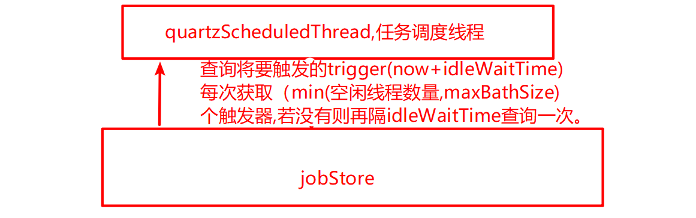

### 一、quartz 配置scheduler

#### 1、使用stdSchedulerFactory

- 此类由quartz类提供，他会去类路径中找quartz.properties文件，如果没有则使用quartz中自带的quartz.properties。

#### 2、使用配置类去配置quartz

- 此方法不再会去主动读取quartz.properties的配置文件，除非人为的去读取配置文件的内容，并调用schedulerFactoryBean的setQuartzProperties方法进行设置，还可以调用schedulerFactoryBean的其他接口设置其他参数，设置的参数和配置文件中如果相同，则会覆盖。

  ```java
  @Configuration
  public class SchedulerConfig {
  @Bean(destroyMethod = "destroy",autowire = Autowire.NO)
  public SchedulerFactoryBean schedulerFactoryBean() throws Exception
  {
      SchedulerFactoryBean schedulerFactoryBean = new SchedulerFactoryBean();
      schedulerFactoryBean.setSchedulerName("123");
      //设置覆盖已存在的任务
      schedulerFactoryBean.setOverwriteExistingJobs(true);
      //项目启动完成后，等待2秒后开始执行调度器初始化
      schedulerFactoryBean.setStartupDelay(2);
      //设置调度器自动运行
      schedulerFactoryBean.setAutoStartup(true);
      //设置配置文件位置
     schedulerFactoryBean.setConfigLocation(new ClassPathResource("quartz.properties"));
  
      return schedulerFactoryBean;
  }
  }
  
  ```

- 使用ClassPathResource查找类路径的配置文件时，会优先从本项目的类路径中查找，若没有则从子项目的类路径中查找。

- 在多模块时，在配置类中去读取类路径中的配置文件，在quartz子moudle的classPath中放一个quartz.properties,在父moudle的classPath中放入一个quartz.properties。如果父moudle和quartz中同时有这个文件，配置类获取优先获取父moudle下classPath中的文件。如果父moudle中没有此文件，则会去读取quartz moudle中classPath下的文件。两个文件的配置是二选一的不会互补。

#### 3、使用springboot的自动化配置

- springboot的quartz-startz会在项目启动时自动注入quartz默认的配置，因此项目不需要任何的配置文件或是配置就可以使用。如果要修改或增加默认配置，可以在application.properties中增加quartz的相关配置。如果项目中有自定义的quartz的配置类，那么springboot的默认配置和applicaton.properties中的配置则会失效。


### 二、如何实例化一个JobDetail

```java
JobDetail jobDetail = JobBuilder.newJob(HelloJob.class)
    			//给job的表示，如果没有设置group,默认在default组。如果没有设置withIdentity参数则默				//认会产生一个随机的jobName,分组默认为default组
    			//如果schduler中 存在相同jobKey的jobDetail则会报错
				.withIdentity("jobName", "jobGroup")
				.usingJobData("key", "value")
    			//job执行时需要实例化的job对象，会覆盖newJob()传入的类对象
    			.ofType(HelloJob.class)
    			//job描述	
    			.withDescription("job detail")
				.build();

```


### 三、如何实例化Trigger

#### 1、如何实例化一个simpleTrigger

```java
Trigger trigger = TriggerBuilder.newTrigger()
				.withIdentity("triggerName", "triggerGroup")
    			//在execute中使用getMergedJobDataMap时会覆盖jobDetail的同key DataMap
				.usingJobData("key", "triggerValue")
				.withSchedule(simpleSchedule()
						.withIntervalInSeconds(1)
						.withRepeatCount(1))
    					....
				.build();
```

#### 2、如何实例化一个cron Trigger

```java
Trigger trigger = TriggerBuilder.newTrigger()
				.withIdentity("triggerName", "triggerGroup")
				.usingJobData("key", "triggerValue")
				.withSchedule(CronScheduleBuilder.cronSchedule("0 42 10 * * ?"))
				.build();
```


### 四、schduler如何遍历内存中所有job

```java
for (String groupName : scheduler.getJobGroupNames()) {
	for (JobKey jobKey : scheduler.getJobKeys(GroupMatcher.jobGroupEquals(groupName))) {
		...
	}
}
```


### 五、如何实例化一个jobKey/triggerKey

#### 1、初始化一个jobKey

- `new JobKey(...)`
- `JobKey.jobkey(...)`

#### 2、初始化一个triggerKey

- `new Trigger(...)`
- `TriggerKey.trigger(...)`


### 六、quartz 源码

#### 1、quartzSchdulerThread-run()

该线程类的主要工作分为以下几个步骤:

- 等待QuartzScheduler启动

- 查询待触发的Trigger
- 等待Trigger触发时间到来
- 触发Trigger
- 循环上述步骤

```java
/*-----------------run()方法有删减----------------------*/
public void run() {
    while (!halted.get()) {
        // -------------------------------
        // 1 等待QuartzScheduler启动
        // -------------------------------
        synchronized (sigLock) {
            while (paused && !halted.get()) {
                // wait until togglePause(false) is called...
                sigLock.wait(1000L);
            }
        }
 
        // -------------------------------
        // 2 查询待触发的Trigger
        // -------------------------------
        int availThreadCount = qsRsrcs.getThreadPool().blockForAvailableThreads();
        if(availThreadCount > 0) { // will always be true, due to semantics of blockForAvailableThreads...
            // 查询未来（now + idletime）时间内待触发的Triggers
            // triggers是按触发时间由近及远排序的集合
            List<OperableTrigger> triggers = qsRsrcs.getJobStore().acquireNextTriggers(
                    now + idleWaitTime, Math.min(availThreadCount, qsRsrcs.getMaxBatchSize()), qsRsrcs.getBatchTimeWindow());
            if (triggers != null && !triggers.isEmpty()) {
                now = System.currentTimeMillis();
                long triggerTime = triggers.get(0).getNextFireTime().getTime();
                long timeUntilTrigger = triggerTime - now;
                // 通过循环阻塞，等待第一个Trigger触发时间
                while(timeUntilTrigger > 2) {
                    synchronized (sigLock) {
                        if (halted.get()) {
                            break;
                        }
                    }
                    now = System.currentTimeMillis();
                    timeUntilTrigger = triggerTime - now;
                }
            // 通知JobStore，这些Triggers将要被触发
            List<TriggerFiredResult> res = qsRsrcs.getJobStore().triggersFired(triggers);
            if(res != null)
                bndles = res;
            }
            // -------------------------------
            // 3 触发Triggers
            // -------------------------------
            for (int i = 0; i < bndles.size(); i++) {
                TriggerFiredResult result =  bndles.get(i);
                TriggerFiredBundle bndle =  result.getTriggerFiredBundle();
                JobRunShell shell = qsRsrcs.getJobRunShellFactory().createJobRunShell(bndle);
                shell.initialize(qs);
                qsRsrcs.getThreadPool().runInThread(shell);
            }
            continue; // while (!halted)
        } else { // if(availThreadCount > 0)
            // should never happen, if threadPool.blockForAvailableThreads() follows contract
            continue; // while (!halted)
        }
    } // while (!halted)
}
```


### 七、quartz插件的使用

#### 1、使用步骤

- 实现`SchedulerPlugin `这个接口

  ```java
  public interface SchedulerPlugin {   
       //Scheduler初始化的时候调用，eg:StdSchedulerFactory.getScheduler()。
       public void initialize(String name, Scheduler scheduler)   
                 throws SchedulerException;   
    
       //调用Scheduler.start()时调用
       public void start(); 
       
       //调用scheduler.shutdown()时调用
       public void shutdown();   
    
  } 
  ```

  ```java
  public class TestPlugin implements SchedulerPlugin {
      private String name;
  
      public String getName() {
          return name;
      }
  
      public void setName(String name) {
          this.name = name;
      }
  
      @Override
      public void initialize(String s, Scheduler scheduler, ClassLoadHelper classLoadHelper) throws SchedulerException {
          System.out.println("initialize");
          System.out.println(name);
      }
  
      @Override
      public void start() {
          System.out.println("start");
      }
  
      @Override
      public void shutdown() {
          System.out.println("shutdown");
      }
  }
  ```

- 在quartz.properties中注册插件

  ```properties
  # 配置插件的实现类
  org.quartz.plugin.{pluginName}.class: {package name}.TestPlugin
  
  # 配置插件实现类中的参数，实现类中需要有setter方法
  org.quartz.plugin.{pluginName}.{paramsName}: {paramsValue}
  ```


#### 2、`XMLSchedulingDataProcessorPlugin`

- 插件的作用：可以在项目启动时，通过一个xml配置文件加入一些需要使用job和trigger。

- 使用步骤：

  - 在pom.xml中加入相关jar包（部分）

    ```xml
    		<dependency>
    			<groupId>org.springframework.boot</groupId>
    			<artifactId>spring-boot-starter-quartz</artifactId>
    		</dependency>
    		<dependency>
    			<groupId>org.quartz-scheduler</groupId>
    			<artifactId>quartz-jobs</artifactId>
    			<version>2.2.0</version>
    		</dependency>
    		<dependency>
    			<groupId>javax.transaction</groupId>
    			<artifactId>jta</artifactId>
    			<version>1.1</version>
    		</dependency>
    ```

    

  - 在resources目录下配置`quartz_data.xml`

    ```xml
    <?xml version="1.0" encoding="UTF-8"?>
    <job-scheduling-data xmlns="http://www.quartz-scheduler.org/xml/JobSchedulingData"
                         xmlns:xsi="http://www.w3.org/2001/XMLSchema-instance"
                         xsi:schemaLocation="http://www.quartz-scheduler.org/xml/JobSchedulingData http://www.quartz-scheduler.org/xml/job_scheduling_data_1_8.xsd"
                         version="1.8"
        <schedule>
            <job>
                <name>TestJob1</name>
                <group>group1</group>
                <job-class>top.catoy.quartzplugin.job.TestJob</job-class>
            </job>
    
            <trigger>
                <simple>
                    <name>TestSimpleTrigger1AtFiveSecondInterval</name>
                    <job-name>TestJob1</job-name>
                    <job-group>group1</job-group>
                    <repeat-count>-1</repeat-count> <!-- repeat indefinitely  -->
                    <repeat-interval>5000</repeat-interval>  <!--  every 5 seconds -->
                </simple>
            </trigger>
        </schedule>
    </job-scheduling-data>
    ```

    [标签参考网址](http://www.quartz-scheduler.org/xml/job_scheduling_data_1_8.xsd)

  - 在`quartz.propertes`中加入配置

    ```properties
    org.quartz.plugin.jobInitializer.class:org.quartz.plugins.xml.XMLSchedulingDataProcessorPlugin
    # 文件名
    org.quartz.plugin.jobInitializer.fileNames: quartz_data.xml
    # 如果未找到xml定义文件，插件是否应该引发异常，从而阻止自身初始化？
    org.quartz.plugin.jobInitializer.failOnFileNotFound = true
    # 如果检测到文件更改，则可以重新加载xml定义文件。这是查看文件的间隔（以秒为单位）。设置为0以禁用扫描。（本人试的时候只有绝对路径时才生效）
    org.quartz.plugin.jobInitializer.scanInterval = 10
    # 如果将XMLSchedulingDataProcessorPlugin与JobStoreCMT一起使用，请确保将此属性的值设置为true，否则可能会遇到意外的行为。
    org.quartz.plugin.jobInitializer.wrapInUserTransaction =false
    ```


### 八、实现quartz的集群

```properties
#集群节点中的instanceName必须相同，instanceId要设置成AUTO
org.quartz.scheduler.instanceName = DefaultQuartzScheduler
org.quartz.scheduler.instanceId = AUTO

#持久化
org.quartz.jobStore.class = org.quartz.impl.jdbcjobstore.JobStoreTX
org.quartz.jobStore.tablePrefix = QRTZ_

#开启集群
org.quartz.jobStore.isClustered = true
```


### 九、quartz可能出现的问题以及解决方式

#### 1、jobDataMap的序列化

​	JobDataMap被用来保存一系列的（序列化的）对象，这些对象在Job执行时可以得到。JobDataMap是Java Map接口的一个实现，而且还增加了一些存储和读取主类型数据的便捷方法。如果使用一个持久的JobStore，那么必须注意存放在JobDataMap中的内容。因为放入JobDataMap中的内容将被序列化，而且 容易出现类型转换问题。很明显，标准Java类型将是非常安全的，但除此之外的类型，任何时候，只要有人改变了你要序列化其实例的类的定义，就要注意是否 打破了程序的兼容性。

#### 2、job的状态

​	如果具体的执行job类继承了job类，此job是无状态的，及你在对jobDetail中的jobDataMap做的所有修改都不会影响下次执行。因为每次执行任务，都会重新实例化一个job。要实现有状态的job，可以实现`StatefulJob`。如果Quartz使用了数据库持久化任务调度信息，**无状态的JobDataMap仅会在Scheduler注册任务时保持一次，而有状态任务对应的JobDataMap在每次执行任务后都会进行保存。**Trigger自身也可以拥有一个JobDataMap，其关联的Job可以通过JobExecutionContext#getTrigger().getJobDataMap()获取Trigger中的JobDataMap。不管是有状态还是无状态的任务，在任务执行期间对Trigger的JobDataMap所做的更改都不会进行持久，也即不会对下次的执行产生影响。

#### 3、时间同步问题

​	Quartz实际并不关心你是在相同还是不同的机器上运行节点。当集群放置在不同的机器上时，称之为水平集群。节点跑在同一台机器上时，称之为垂直集群。对于垂直集群，存在着单点故障的问题。这对高可用性的应用来说是无法接受的，因为一旦机器崩溃了，所有的节点也就被终止了。对于水平集群，存在着时间同步问题。节点用时间戳来通知其他实例它自己的最后检入时间。假如节点的时钟被设置为将来的时间，那么运行中的Scheduler将再也意识不到那个结点已经宕掉了。另一方面，如果某个节点的时钟被设置为过去的时间，也许另一节点就会认定那个节点已宕掉并试图接过它的Job重运行。最简单的同步计算机时钟的方式是使用某一个Internet时间服务器(Internet Time Server ITS)

### 八、quartz配置文件

```properties
# Default Properties file for use by StdSchedulerFactory
# to create a Quartz Scheduler Instance, if a different
# properties file is not explicitly specified.
#
# ===========================================================================
# Configure Main Scheduler Properties 调度器属性
# ===========================================================================
org.quartz.scheduler.instanceName: DefaultQuartzScheduler
org.quartz.scheduler.instanceid:AUTO
org.quartz.scheduler.rmi.export: false
org.quartz.scheduler.rmi.proxy: false
org.quartz.scheduler.wrapJobExecutionInUserTransaction: false
# ===========================================================================  
# Configure ThreadPool 线程池属性  
# ===========================================================================
#线程池的实现类（一般使用SimpleThreadPool即可满足几乎所有用户的需求）
org.quartz.threadPool.class: org.quartz.simpl.SimpleThreadPool
#指定线程数，至少为1（无默认值）(一般设置为1-100直接的整数合适)
org.quartz.threadPool.threadCount: 10
#设置线程的优先级（最大为java.lang.Thread.MAX_PRIORITY 10，最小为Thread.MIN_PRIORITY 1，默认为5）
org.quartz.threadPool.threadPriority: 5
#设置SimpleThreadPool的一些属性
#设置是否为守护线程
#org.quartz.threadpool.makethreadsdaemons = false
#org.quartz.threadPool.threadsInheritContextClassLoaderOfInitializingThread: true
#org.quartz.threadpool.threadsinheritgroupofinitializingthread=false
#线程前缀默认值是：[Scheduler Name]_Worker
#org.quartz.threadpool.threadnameprefix=swhJobThead;
# 配置全局监听(TriggerListener,JobListener) 则应用程序可以接收和执行 预定的事件通知
# ===========================================================================
# Configuring a Global TriggerListener 配置全局的Trigger监听器
# MyTriggerListenerClass 类必须有一个无参数的构造函数，和 属性的set方法，目前2.2.x只支持原始数据类型的值（包括字符串）
# ===========================================================================
#org.quartz.triggerListener.NAME.class = com.swh.MyTriggerListenerClass
#org.quartz.triggerListener.NAME.propName = propValue
#org.quartz.triggerListener.NAME.prop2Name = prop2Value
# ===========================================================================
# Configuring a Global JobListener 配置全局的Job监听器
# MyJobListenerClass 类必须有一个无参数的构造函数，和 属性的set方法，目前2.2.x只支持原始数据类型的值（包括字符串）
# ===========================================================================
#org.quartz.jobListener.NAME.class = com.swh.MyJobListenerClass
#org.quartz.jobListener.NAME.propName = propValue
#org.quartz.jobListener.NAME.prop2Name = prop2Value
# ===========================================================================  
# Configure JobStore 存储调度信息（工作，触发器和日历等）
# ===========================================================================
# 信息保存时间 默认值60秒
org.quartz.jobStore.misfireThreshold: 60000
#保存job和Trigger的状态信息到内存中的类
org.quartz.jobStore.class: org.quartz.simpl.RAMJobStore
# ===========================================================================  
# Configure SchedulerPlugins 插件属性 配置
# ===========================================================================
# 自定义插件  
#org.quartz.plugin.NAME.class = com.swh.MyPluginClass
#org.quartz.plugin.NAME.propName = propValue
#org.quartz.plugin.NAME.prop2Name = prop2Value
#配置trigger执行历史日志（可以看到类的文档和参数列表）
org.quartz.plugin.triggHistory.class = org.quartz.plugins.history.LoggingTriggerHistoryPlugin  
org.quartz.plugin.triggHistory.triggerFiredMessage = Trigger {1}.{0} fired job {6}.{5} at\: {4, date, HH\:mm\:ss MM/dd/yyyy}  
org.quartz.plugin.triggHistory.triggerCompleteMessage = Trigger {1}.{0} completed firing job {6}.{5} at {4, date, HH\:mm\:ss MM/dd/yyyy} with resulting trigger instruction code\: {9}  
#配置job调度插件  quartz_jobs(jobs and triggers内容)的XML文档  
#加载 Job 和 Trigger 信息的类   （1.8之前用：org.quartz.plugins.xml.JobInitializationPlugin）
org.quartz.plugin.jobInitializer.class = org.quartz.plugins.xml.XMLSchedulingDataProcessorPlugin
#指定存放调度器(Job 和 Trigger)信息的xml文件，默认是classpath下quartz_jobs.xml
org.quartz.plugin.jobInitializer.fileNames = my_quartz_job2.xml  
#org.quartz.plugin.jobInitializer.overWriteExistingJobs = false  
org.quartz.plugin.jobInitializer.failOnFileNotFound = true  
#自动扫描任务单并发现改动的时间间隔,单位为秒
org.quartz.plugin.jobInitializer.scanInterval = 10
#覆盖任务调度器中同名的jobDetail,避免只修改了CronExpression所造成的不能重新生效情况
org.quartz.plugin.jobInitializer.wrapInUserTransaction = false
# ===========================================================================  
# Sample configuration of ShutdownHookPlugin  ShutdownHookPlugin插件的配置样例‹
# ===========================================================================
#org.quartz.plugin.shutdownhook.class = \org.quartz.plugins.management.ShutdownHookPlugin
#org.quartz.plugin.shutdownhook.cleanShutdown = true
#
# Configure RMI Settings 远程服务调用配置
#
#如果你想quartz-scheduler出口本身通过RMI作为服务器，然后设置“出口”标志true(默认值为false)。
#org.quartz.scheduler.rmi.export = false
#主机上rmi注册表(默认值localhost)
#org.quartz.scheduler.rmi.registryhost = localhost
#注册监听端口号（默认值1099）
#org.quartz.scheduler.rmi.registryport = 1099
#创建rmi注册，false/never：如果你已经有一个在运行或不想进行创建注册
# true/as_needed:第一次尝试使用现有的注册，然后再回来进行创建
# always:先进行创建一个注册，然后再使用回来使用注册
#org.quartz.scheduler.rmi.createregistry = never
#Quartz Scheduler服务端端口，默认是随机分配RMI注册表
#org.quartz.scheduler.rmi.serverport = 1098
#true:链接远程服务调度(客户端),这个也要指定registryhost和registryport，默认为false
# 如果export和proxy同时指定为true，则export的设置将被忽略
#org.quartz.scheduler.rmi.proxy = false
```


### 九、配置文件优化配置

- `batchTriggerAcquisitionMaxCount`参数的意思是一次批量查询trigger的数量，数字越大触发效率越高，但并不是你配置多少它每次就能查询多少，这算一个优化的配置项，因为在jdbc store的时候，减少对数据库的轮询次数算是一个比较大的优化；

  ```java
  //idleWaitTime对应org.quartz.scheduler.idleWaitTime，这里now+idleWaitTime表示quartz
  //可以获取的任务中最晚的触发时间（当前时刻+idleWaitTime这个时间段会触发的trigger都会被获取），即允许任务被触发的时间在当前时间之后一段时间就能从数据库取出
  triggers = qsRsrcs.getJobStore().acquireNextTriggers(
                                  now + idleWaitTime, Math.min(availThreadCount, qsRsrcs.getMaxBatchSize()), qsRsrcs.getBatchTimeWindow())
  ```

  可以看到这里会取配置的批量的数和可用线程的最小数，所以批量数可以配置成和线程数大小一致。当检查某个Trigger应该触发时，默认每次只Acquire一个Trigger，（为什么要有Acquire的过程呢？是为了防止多线程访问的情况下，同一个Trigger被不同的线程多次触发）。尤其是使用JDBC JobStore时，一次Acquire就是一个update语句，尽可能一次性的多获取几个Trigger，一起触发，当定时器数量非常大的时候，这是个非常有效的优化。当定时器数量比较少时，触发不是极为频繁时，这个优化的意义就不大了。<font color='red'>需要注意的是，如果你的定时任务需要在准确的时间点触发（精确到秒），那么最好这个参数不要动,因为它等于1，才能确保定时任务在准确的时间点触发。</font>

  ```properties
  # 线程数量
  org.quartz.threadPool.threadCount= 20
  
  # 在调度程序处于空闲状态时，调度程序将在重新查询可用触发器之前等待的时间量（以毫秒为单位）
  # 不能小于5000
  org.quartz.scheduler.idleWaitTime=***
  
  # 一次获取trigger的最大数量
  org.quartz.scheduler.batchTriggerAcquisitionMaxCount= 20　
  ```

  

总结：对触发时间精确度不高，且触发器数量较多时，可以使用`batchTriggerAcquisitionMaxCount`。它可以减少对数据库的访问频率。

