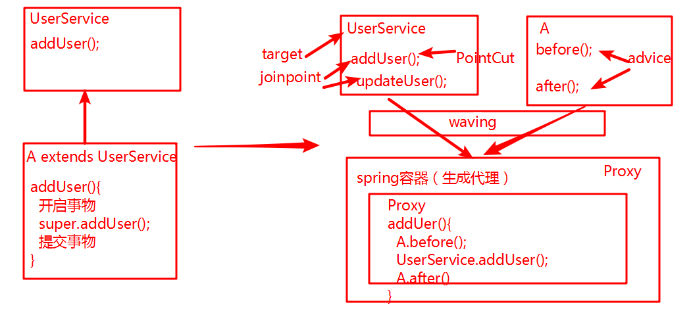
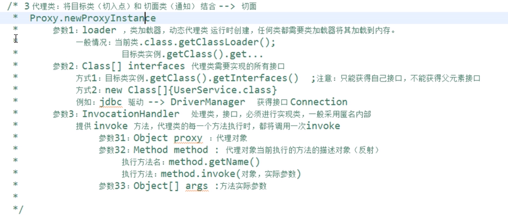

# AOP

## 一、简介

- Aspect Oriented Programming​:面向切面编程。

- 降低耦合度提高可重用性

- 底层采用代理机制实现

- oop(面向对象编程)的延续

- 横向抽取机制取代了纵向继承

  （性能监视、事物管理、安全检查、缓存）



## 二、AOP实现原理

- 接口+实现类：spring 采用jdk的动态代理Proxy
- 实现类：cglib字节码增强

## 三、AOP术语

- target:需要被代理的类
- JoinPoint:连接点，那些可能被拦截的方法
- PoinCut:切入点，已经被增强的连接点
- Advice:通知，增强的代码，例如：after,before
- weaving:织入
- Proxy:代理类
- Aspect:切面，切入点和通知的结合

## 四、手动方式

### 4.1jdk动态代理

#### 4.11目标类

```java
@Service
public class UserServiceImpl implements UserService {
    public void addUser() {
        System.out.println("addUser");
    }

    public void delUser() {
        System.out.println("delUser");
    }

    public void updateUser() {
        System.out.println("updateUser");
    }
}
```

#### 4.12切面MyAspect

```java
public class MyAspect {
    public void before(){
        System.out.println("before()");
    }

    public void after(){
        System.out.println("after()");
    }
}
```

#### 4.13工厂BeanFacory



```java
public class BeanFactory {
   public static UserService creatBean(){
        //目标类
       final UserService userService = new UserServiceImpl();
        //切面类
       final MyAspect myAspect = new MyAspect();
        //代理类
        UserService userServiceProxy =(UserService) Proxy.newProxyInstance(BeanFactory.class.getClassLoader(),userService.getClass().getInterfaces(), new InvocationHandler() {
            public Object invoke(Object proxy, Method method, Object[] args) throws Throwable {
               Object result = null;
                if(method.getName().equals("addUser")){
                    //执行前方法
                    myAspect.before();
                    //执行代理类方法
                    result = method.invoke(userService,args);
                    //Object result = method.invoke(userService,args);
                    //执行后方法
                    myAspect.after();
                }
                return result;
            }
        });
        return userServiceProxy;
    }
}
```

#### 4.14测试

```java
@Test
public void test(){
    UserService userService = BeanFactory.creatBean();
    userService.addUser();
    userService.delUser();
}
/**
 * before()
 * addUser
 * after()
 */
```

### 4.2CGLIB

- 没有借口只有实现类
- 采用字节码增强框架cglib,在运行时创建子类，从而对目标进行增强。
- spring-core中已经存在

#### 4.21目标类

```java
public class UserServiceImpl{
    public void addUser() {
        System.out.println("addUser");
    }

    public void delUser() {
        System.out.println("delUser");
    }

    public void updateUser() {
        System.out.println("updateUser");
    }
}
```

#### 4.22切面

```java
public class MyAspect {
    public void before(){
        System.out.println("before()");
    }

    public void after(){
        System.out.println("after()");
    }
}
```

#### 4.23工厂BeanFactory

```java
public class BeanFactoryCjlib {
    public static UserServiceImpl creatBean(){
       //目标类
        final UserServiceImpl userService = new UserServiceImpl();
        //切面类
        final MyAspect myAspect = new MyAspect();
        //代理类,底层:创建目标类的子类
        //核心类
        Enhancer enhancer = new Enhancer();
        //确定父类
        enhancer.setSuperclass(UserServiceImpl.class);
        //设置回调函数,MethodInterceptorde等同于InvocationHandler
        //intercept前三个参数和jdk invoke一样
        enhancer.setCallback(new MethodInterceptor(){
            public Object intercept(Object o, Method method, Object[] objects, MethodProxy methodProxy) throws Throwable {
                Object result = null;
                if(method.getName().equals("addUser")){
                    //执行前方法
                    myAspect.before();
                    //执行代理类方法
                    result = method.invoke(userService,objects);
                    //Object result = method.invoke(userService,args);
                    //执行后方法
                    myAspect.after();
                }
                return result;
            }
        });
        //创建代理类
        UserServiceImpl userService1 =(UserServiceImpl) enhancer.create();
        return userService1;
    }
}
```

#### 4.14测试

```java
@Test
public void testCjlib(){
    UserServiceImpl userService = BeanFactoryCjlib.creatBean();
    userService.addUser();
    userService.delUser();
}
/**
 * before()
 * addUser
 * after()
 */
```

