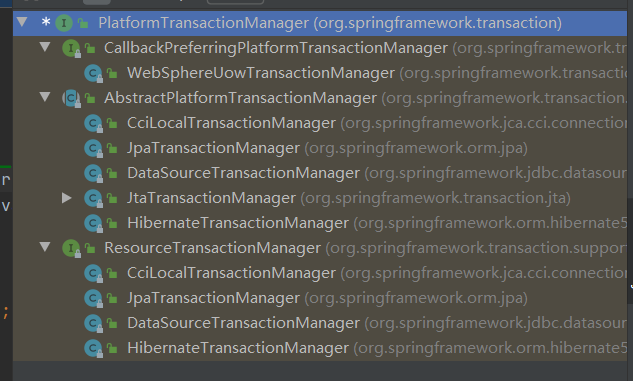

# 事务-TS

一、

	- 声明式事务
	- 编程式事务

spring 已经为我们写好了切面（事务管理器）`PlatformTransactionManager`



`JdbcTemplate`和`Mybatis`使用`DataSourceTransactionManager`


### 二、配置事务

#### 2.1 xml和注解配置

```xml
<?xml version="1.0" encoding="UTF-8"?>
<beans xmlns:xsi="http://www.w3.org/2001/XMLSchema-instance"
       xmlns="http://www.springframework.org/schema/beans"
       xmlns:context="http://www.springframework.org/schema/context" xmlns:tx="http://www.springframework.org/schema/tx"
       xsi:schemaLocation="http://www.springframework.org/schema/beans http://www.springframework.org/schema/beans/spring-beans-4.3.xsd http://www.springframework.org/schema/context http://www.springframework.org/schema/context/spring-context-4.3.xsd http://www.springframework.org/schema/tx http://www.springframework.org/schema/tx/spring-tx.xsd">


    <context:component-scan base-package="top.catoy"></context:component-scan>

    <!--  配置数据源  -->
    <bean id="dataSource" class="com.mchange.v2.c3p0.ComboPooledDataSource">
        <property name="user" value="root"></property>
        <property name="password" value="123456"></property>
        <property name="jdbcUrl" value="jdbc:mysql://localhost:3306/ts?useSSL=false&amp;serverTimezone=UTC&amp;characterEncoding=utf-8"></property>
        <property name="driverClass" value="com.mysql.cj.jdbc.Driver"></property>
    </bean>

    <!--  配置jdbcTemplate  -->
    <bean class="org.springframework.jdbc.core.JdbcTemplate">
        <property name="dataSource" ref="dataSource"></property>
    </bean>

    <!--  事务控制  -->
    <!--  1、配置事务管理器（一个写好的切面）  -->
    <bean id="transactionManager" class="org.springframework.jdbc.datasource.DataSourceTransactionManager">
        <!--  指定数据源  -->
        <property name="dataSource" ref="dataSource">
        </property>
    </bean>

    <!--  2、开启基于注解的事务控制模式  -->
    <tx:annotation-driven transaction-manager="transactionManager" />

    <!--  3、给事务方法加注解  -->


```

2.2纯注解配置


### 三、事务的细节

#### 3.1


### 一、注解基本属性

```java

Propagation propagation() default Propagation.REQUIRED;//事务的传播行为

Isolation isolation() default Isolation.DEFAULT;//事务的隔离级别

int timeout() default -1;//超时指定时长后自动回滚

String timeoutString() default "";//超时指定时长后自动回滚

boolean readOnly() default false;//设置事务为只读事务，没有增删改操作

Class<? extends Throwable>[] rollbackFor() default {};//哪些异常事务需要回滚

String[] rollbackForClassName() default {};//哪些异常事务需要回滚

Class<? extends Throwable>[] noRollbackFor() default {};//哪些异常事务可以不回滚

String[] noRollbackForClassName() default {};//哪些异常事务可以不回滚
```


### 二、回滚机制

> **可检查异常**

​	事务没法回滚

> **不可检查异常**

​	事务可以回滚


### 三、实现机制

​	aop


### 四、隔离级别

#### 4.1 并发事务带来的问题

在典型的应用程序中，多个事务并发运行，经常会操作相同的数据来完成各自的任务（多个用户对统一数据进行操作）。并发虽然是必须的，但可能会导致以下的问题。

- **脏读（Dirty read）:** 当一个事务正在访问数据并且对数据进行了修改，而这种修改还没有提交到数据库中，这时另外一个事务也访问了这个数据，然后使用了这个数据。因为这个数据是还没有提交的数据，那么另外一个事务读到的这个数据是“脏数据”，依据“脏数据”所做的操作可能是不正确的。(读取其他未commit的数据)
- **丢失修改（Lost to modify）:** 指在一个事务读取一个数据时，另外一个事务也访问了该数据，那么在第一个事务中修改了这个数据后，第二个事务也修改了这个数据。这样第一个事务内的修改结果就被丢失，因此称为丢失修改。 例如：事务1读取某表中的数据A=20，事务2也读取A=20，事务1修改A=A-1，事务2也修改A=A-1，最终结果A=19，事务1的修改被丢失。
- **不可重复读（Unrepeatableread）:** 指在一个事务内多次读同一数据。在这个事务还没有结束时，另一个事务也访问该数据。那么，在第一个事务中的两次读数据之间，由于第二个事务的修改导致第一个事务两次读取的数据可能不太一样。这就发生了在一个事务内两次读到的数据是不一样的情况，因此称为不可重复读。
- **幻读（Phantom read）:** 幻读与不可重复读类似。它发生在一个事务（T1）读取了几行数据，接着另一个并发事务（T2）插入了一些数据时。在随后的查询中，第一个事务（T1）就会发现多了一些原本不存在的记录，就好像发生了幻觉一样，所以称为幻读。

**不可重复度和幻读区别：**

不可重复读的重点是修改，幻读的重点在于新增或者删除。

例1（同样的条件, 你读取过的数据, 再次读取出来发现值不一样了 ）：事务1中的A先生读取自己的工资为 1000的操作还没完成，事务2中的B先生就修改了A的工资为2000，导 致A再读自己的工资时工资变为 2000；这就是不可重复读。

例2（同样的条件, 第1次和第2次读出来的记录数不一样 ）：假某工资单表中工资大于3000的有4人，事务1读取了所有工资大于3000的人，共查到4条记录，这时事务2 又插入了一条工资大于3000的记录，事务1再次读取时查到的记录就变为了5条，这样就导致了幻读。


#### 4.2 事务隔离级别

**SQL 标准定义了四个隔离级别：**

- **READ-UNCOMMITTED(读取未提交)：** 最低的隔离级别，允许读取尚未提交的数据变更，**可能会导致脏读、幻读或不可重复读**。
- **READ-COMMITTED(读取已提交)：** 允许读取并发事务已经提交的数据，**可以阻止脏读，但是幻读或不可重复读仍有可能发生**。
- **REPEATABLE-READ(可重复读)：** 对同一字段的多次读取结果都是一致的，除非数据是被本身事务自己所修改，**可以阻止脏读和不可重复读，但幻读仍有可能发生**。
- **SERIALIZABLE(可串行化)：** 最高的隔离级别，完全服从ACID的隔离级别。所有的事务依次逐个执行，这样事务之间就完全不可能产生干扰，也就是说，**该级别可以防止脏读、不可重复读以及幻读**。

**两个事务之间的敏感度之间下降**

------

| 隔离级别         | 脏读 | 不可重复读 | 幻影读 |
| ---------------- | ---- | ---------- | ------ |
| READ-UNCOMMITTED | √    | √          | √      |
| READ-COMMITTED   | ×    | √          | √      |
| REPEATABLE-READ  | ×    | ×          | √      |
| SERIALIZABLE     | ×    | ×          | ×      |


### 五、事务的传播行为

> required

- 已经有事务，共用事务，若没有事务则创建新的事务
- 事务的属性都继承于大事务                                         
- 底层：将之前事务用的connection专递过来

> requiredNew

- 创建新的事务
- 底层：重新创建一个connection

​      

官方翻译文档https://blog.csdn.net/hbtj_1216/article/details/86666359


## 六、分布式事务