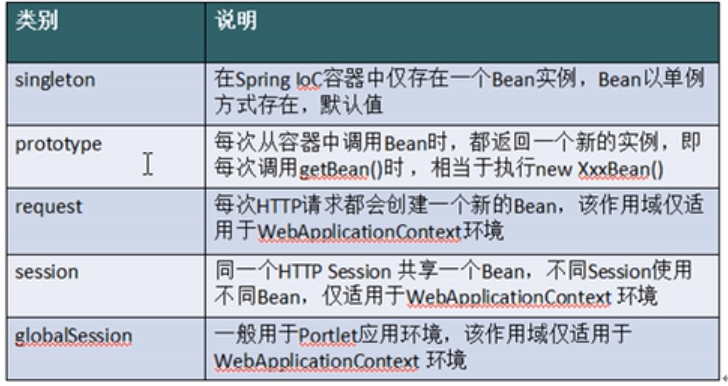
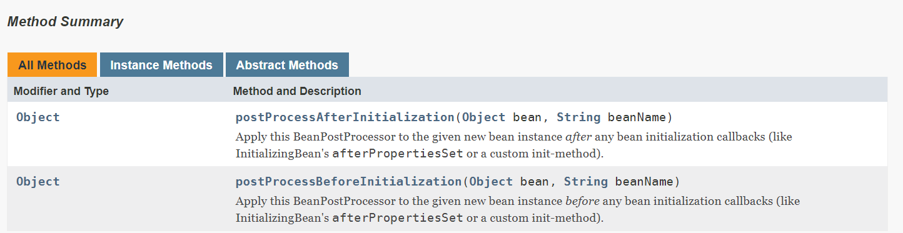

# 装配Bean

## 一、基于XML

### 1.1 实例化方法

- 3种bean实例化方法，默认构造、静态工厂、实例工厂

#### 1.11默认构造

```xml
//默认无参构造函数
<Bean id="" class=""><Bean>
```


#### 1.12静态工厂

- 用于整合其他框架或工具
- 静态工厂：用于生成势力对象，所有的方法必须是static

```xml
<!--<Bean id="" class="工厂全限定类名" factory-method="静态方法">-->
<!--将静态工厂创建的实例交给spring-->
<bean id="myBeanFactoryId" class="BeanFacoty.MyBeanFacory" factory-method="createServie"></bean>
```

```java
//静态工厂类
public class MyBeanFacory {
    public static UserService createServie(){
        return new UserServiceImpl();
    }
}
```

```java
public class TestBeanFactory {
    @Test
    public void testBeanFactory(){
        String path = "applicationContext.xml";
        ApplicationContext applicationContext = new ClassPathXmlApplicationContext(path);
        UserService userService = applicationContext.getBean("myBeanFactoryId",UserService.class);
        System.out.println(userService.getAllInfo());
    }
}
```

#### 1.13实例工厂

- 必须先有工厂实例，通过实例创建对象，提供的所有方法都是非静态的

```xml
<!--将实例工厂创建的实例交给spring-->
<!--创建工厂实例-->
<bean id="myBeanFactoryId2" class="BeanFacoty.MyBeanFacory2"></bean>
<!--获得工厂创建的实例-->
<bean id="userServiceid" factory-bean="myBeanFactoryId2" factory-method="createService"></bean>
```

```java
//实例工厂
public class MyBeanFacory2 {
    public UserService createService(){
        return new UserServiceImpl();
    }
}
```

```java
@Test
public void testBeanFactory2(){
    String path = "applicationContext.xml";
    ApplicationContext applicationContext = new ClassPathXmlApplicationContext(path);
    UserService userService = applicationContext.getBean("userServiceid2",UserService.class);
    System.out.println(userService.getAllInfo());
}
```

## 二、基于注解

## 三、Bean的种类

- 普通bean<bean id="" class="A"><bean>创建A的实例并返回
- FactoryBean：是一个特殊的bean,具有工厂生产对象的能力，只能生产特定对象。bean必须去实现FactoryBean接口，此接口提供一个方法getObject(),用于返回特定的bean。AOP使用

## 四、Bean作用域



### 4.1配置文件

```xml
<!--bean作用域-->
<!--单例-->
<bean id="userServiceId3" class="service.impl.UserServiceImpl" scope="singleton"></bean>
<!--多例-->
<bean id="userServiceId4" class="service.impl.UserServiceImpl" scope="prototype"></bean>
```

### 4.2生产实例

```java
//单例
@Test
public void testScope(){
    String path = "applicationContext.xml";
    ApplicationContext applicationContext = new ClassPathXmlApplicationContext(path);
    UserService userService1 = applicationContext.getBean("userServiceId3",UserService.class);
    UserService userService2 = applicationContext.getBean("userServiceId3",UserService.class);
    System.out.println(userService1);//service.impl.UserServiceImpl@79be0360
    System.out.println(userService2);//service.impl.UserServiceImpl@79be0360
}
```

```java
//多例
@Test
public void testScope2(){
    String path = "applicationContext.xml";
    ApplicationContext applicationContext = new ClassPathXmlApplicationContext(path);
    UserService userService1 = applicationContext.getBean("userServiceId4",UserService.class);
    UserService userService2 = applicationContext.getBean("userServiceId4",UserService.class);
    System.out.println(userService1);//service.impl.UserServiceImpl@79be0360
    System.out.println(userService2);//service.impl.UserServiceImpl@22a67b4
}
```

## 五、Bean生命周期

## 5.1初始化和销毁

- 初始化：准备数据
- 销毁：销毁数据。容器销毁才能执行，bean要为单例

### 5.11配置文件

```xml
<!--生命周期-->
<bean id="userServiceId5"
      class="service.impl.UserServiceImplLifeCycle"
      init-method="myInit"
      destroy-method="myDestroy">
</bean>
```

### 5.12增加初始化和销毁方法

```java
public class UserServiceImplLifeCycle implements UserService {
    private UserDao userDao;

    public UserServiceImplLifeCycle() {
        this.userDao = new UserDaoImpl();
    }

    public void setUserDao(UserDao userDao) {
        this.userDao = userDao;
    }

    public User getAllInfo() {
        return userDao.getAllInfo();
    }

    public void myInit(){
        System.out.println("初始化");
    }

    public void myDestroy(){
        System.out.println("销毁");
    }
}
```

### 5.13测试

```java
@Test
public void testLifeCicle(){
    String path = "applicationContext.xml";
    //初始化容器
    ApplicationContext applicationContext = new ClassPathXmlApplicationContext(path);
    //销毁容器
    ((ClassPathXmlApplicationContext) applicationContext).destroy();
}
/**
 * 初始化
 * 四月 22, 2019 11:54:47 下午 org.springframework.context.support.ClassPathXmlApplicationContext doClose
 * 信息: Closing org.springframework.context.support.ClassPathXmlApplicationContext@3ada9e37: startup date [Mon Apr 22 23:54:46 CST 2019]; root of context hierarchy
 * 销毁
 */
```

## 5.2beanPostProcess

- 只要实现这个接口(beanPostProcess)，并且将实现类提供给spring容器，在初始化方法前将执行before(),在初始化方法之后将执行after()



- spring提供工厂钩子用于修改实例，对象可以生成代理对象，是AOP底层

  模拟：

  A a = new A();

  a = B.before(a);   -->将实例对象a传给后处理bean，生成代理对象并返回

  a.init();	

  a = B.after(a);

  a.function();

  a.destroy();

### 5.21 beanPostProcess实现类提供给容器


