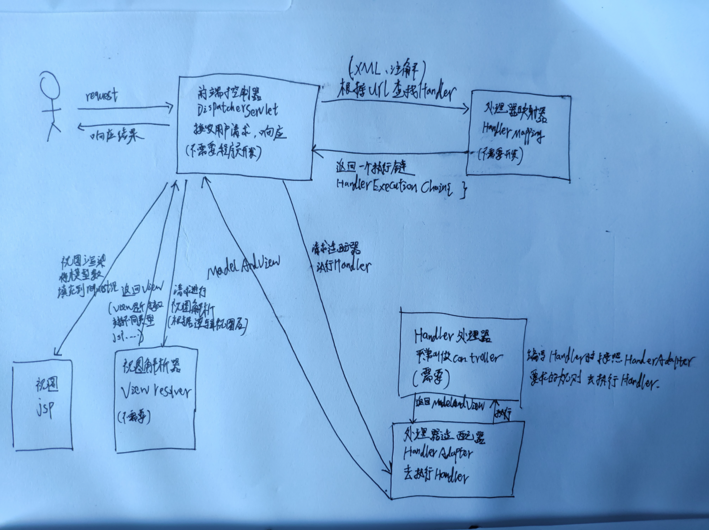

### 前身:servlet


servlet其实就是个规范，当浏览器发送请求后，servlet容器(tomcat、jetty)就会在某个端口监听到一个请求，servlet容器将发来的请求封装成request对象，并调用servlet api,将对象发送给servlet实例，servlet经过一系列的业务逻辑处理后，将返回一个response对象给servlet容器，servlet容器接受到response对象后进过一系列的处理，将数据返回给浏览器。


### 今世:DispatcherServlet


### mvc配置文件

##### pom.xml

spring  其他几个核心包都依赖spring-context，所以只要引入context即可

```xml
<dependency>
    <groupId>org.springframework</groupId>
    <artifactId>spring-context</artifactId>
    <version>${spring.version}</version>
    <exclusions>
        <!--排除commons looging依赖-->
        <exclusion>
            <groupId>commons-logging</groupId>
            <artifactId>commons-logging</artifactId>
        </exclusion>
    </exclusions>
</dependency>
```

web相关包都依赖spring-webmvc,所以只要引入这一个包就够了

```xml
<dependency>
    <groupId>org.springframework</groupId>
    <artifactId>spring-webmvc</artifactId>
    <version>${spring.version}</version>
</dependency>
```

集成Tomcat 插件

```xml
<packaging>war</packaging>
```

```xml
<build>
        <plugins>
            <plugin>
                <groupId>org.apache.tomcat.maven</groupId>
                <artifactId>tomcat7-maven-plugin</artifactId>
                <version>2.2</version>
                <configuration>
                    <path>/</path>
                    <port>8080</port>
                </configuration>
            </plugin>
        <plugins>
</build>
```


##### web.xml

注册servlet,listener,filter,interceptor...

```xml
<?xml version="1.0" encoding="UTF-8"?>
<web-app xmlns="http://xmlns.jcp.org/xml/ns/javaee"
         xmlns:xsi="http://www.w3.org/2001/XMLSchema-instance"
         xsi:schemaLocation="http://xmlns.jcp.org/xml/ns/javaee http://xmlns.jcp.org/xml/ns/javaee/web-app_4_0.xsd"
         version="4.0">
    <listener>
        <listener-class>org.springframework.web.context.ContextLoaderListener</listener-class>
    </listener>
		<context-param>
			<param-name>contextConfigLocation</param-name>
			<param-value>classpath:applicationContext.xml</param-value><!--根容器（dao...）-->
		</context-param>
    <servlet>
        <servlet-name>dispatcher</servlet-name>
        <servlet-class>org.springframework.web.servlet.DispatcherServlet</servlet-class>
        <init-param>
            <param-name>contextConfigLocation</param-name>
            <param-value>/WEB-INF/applicationContext.xml</param-value><!--子容器 (ViewResovler)-->
        </init-param>
        <load-on-startup>1</load-on-startup>
    </servlet>
    <servlet-mapping>
        <servlet-name>dispatcher</servlet-name>
        <url-pattern>/</url-pattern>
    </servlet-mapping>
</web-app>
```


##### applicationContext.xml(子容器)

包扫描，bean的注入，视图解析器...

```xml
<?xml version="1.0" encoding="UTF-8"?>
<beans xmlns="http://www.springframework.org/schema/beans"
       xmlns:xsi="http://www.w3.org/2001/XMLSchema-instance"
       xmlns:context="http://www.springframework.org/schema/context"
       xsi:schemaLocation="http://www.springframework.org/schema/beans http://www.springframework.org/schema/beans/spring-beans.xsd http://www.springframework.org/schema/context https://www.springframework.org/schema/context/spring-context.xsd">

    <context:component-scan base-package="top.catoy.controller"/>

    <!-- 视图解析器  -->
    <bean id="viewResolver"
          class="org.springframework.web.servlet.view.InternalResourceViewResolver">
        <!-- 前缀 -->
        <property name="prefix">
            <value>/WEB-INF/</value>
        </property>
        <!-- 后缀 -->
        <property name="suffix">
            <value>.jsp</value>
        </property>
    </bean>
    ...
</beans>
```

Spring的`DispatcherServlet`使用了特殊的bean来处理请求、渲染视图等，这些特定的bean是Spring MVC框架的一部分。如果你想指定使用哪个特定的bean，你可以在web应用上下文`WebApplicationContext`中简单地配置它们。当然这只是可选的，Spring MVC维护了一个默认的bean列表，如果你没有进行特别的配置，框架将会使用默认的bean。下一小节会介绍更多的细节，这里，我们将先快速地看一下，`DispatcherServlet`都依赖于哪些特殊的bean来进行它的初始化。

| bean的类型                                                   | 作用                                                         |
| :----------------------------------------------------------- | :----------------------------------------------------------- |
| [`HandlerMapping`](https://spring-mvc.linesh.tw/publish/21-4/handler-mappings.html) | 处理器映射。它会根据某些规则将进入容器的请求映射到具体的处理器以及一系列前处理器和后处理器（即处理器拦截器）上。具体的规则视`HandlerMapping`类的实现不同而有所不同。其最常用的一个实现支持你在控制器上添加注解，配置请求路径。当然，也存在其他的实现。(就是找到Controller层具体的某个方法) |
| `HandlerAdapter`                                             | 处理器适配器。拿到请求所对应的处理器后，适配器将负责去调用该处理器，这使得`DispatcherServlet`无需关心具体的调用细节。比方说，要调用的是一个基于注解配置的控制器，那么调用前还需要从许多注解中解析出一些相应的信息。因此，`HandlerAdapter`的主要任务就是对`DispatcherServlet`屏蔽这些具体的细节。 |
| [`HandlerExceptionResolver`](https://spring-mvc.linesh.tw/publish/21-11/1-handler-exception-handler.html) | 处理器异常解析器。它负责将捕获的异常映射到不同的视图上去，此外还支持更复杂的异常处理代码。 |
| [`ViewResolver`](https://spring-mvc.linesh.tw/publish/21-5/resolving-views.html) | 视图解析器。它负责将一个代表逻辑视图名的字符串（String）映射到实际的视图类型`View`上。 |
| [`LocaleResolver`](https://spring-mvc.linesh.tw/publish/21-8/using-locales.html) & [`LocaleContextResolver`](https://spring-mvc.linesh.tw/publish/21-8/1-obtaining-time-zone-information.html) | 地区解析器 和 地区上下文解析器。它们负责解析客户端所在的地区信息甚至时区信息，为国际化的视图定制提供了支持。 |
| [`ThemeResolver`](https://spring-mvc.linesh.tw/publish/21-9/1-overview-of-themes.html) | 主题解析器。它负责解析你web应用中可用的主题，比如，提供一些个性化定制的布局等。 |
| [`MultipartResolver`](https://spring-mvc.linesh.tw/publish/21-10/springs-multipart-file-upload-support.html) | 解析multi-part的传输请求，比如支持通过HTML表单进行的文件上传等。 |
| [`FlashMapManager`](https://spring-mvc.linesh.tw/publish/21-6/using-flash-attributes.html) | FlashMap管理器。它能够存储并取回两次请求之间的`FlashMap`对象。后者可用于在请求之间传递数据，通常是在请求重定向的情境下使用。 |



### springMVC注解驱动

适用版本3.1+

applicationContext.xml可替换成java文件

```java
@Configuration
@EnableWebMvc//激活webmvc组件
public class WebMvcConfig extends WebMvcConfigurerAdapter {//最新是直接实现WebMvcConfigurer接口
    @Bean
    public ViewResolver viewResolver(){
        InternalResourceViewResolver viewResolver = new InternalResourceViewResolver();
        viewResolver.setViewClass(JstlView.class);
        viewResolver.setPrefix("/WEB-INF/");
        viewResolver.setSuffix(".jsp");
        return viewResolver;
    }

    @Override
    public void addInterceptors(InterceptorRegistry interceptorRegistry) {

    }
}
```


### 父子容器

https://zhuanlan.zhihu.com/p/69029697

​	web容器(tomcat)，为web应用提供了一个全局上下文`ServletContext`。web.xml中定义了一个`contextLoaderListener`,当web容器启动时,会出发这个监听器，并调用`contextInitialized`方法。该方法会初始化一个根容器即`WebApplicationContext`。加载的配置文件路径由`<context-param>`定义：

```xml
<context-param>
			<param-name>contextConfigLocation</param-name>
			<param-value>classpath:applicationContext.xml</param-value><!--根容器（dao...）-->
</context-param>
```

`WebApplicationContext`以`ROOTWEBAPPLICATIONCONTEXTATTRIBUTE`为key属性被存储在`ServletContext`中。

​	之后web.xml中配置的servlet会被初始化，每个servlet都可以配置自己的ioc容器,里面可以定义处理映射器、视图解析器等：

```xml
<servlet>
        <servlet-name>dispatcher</servlet-name>
        <servlet-class>org.springframework.web.servlet.DispatcherServlet</servlet-class>
        <init-param>
            <param-name>contextConfigLocation</param-name>
            <param-value>/WEB-INF/applicationContext.xml</param-value>
        </init-param>
        <load-on-startup>1</load-on-startup>
</servlet>
```

