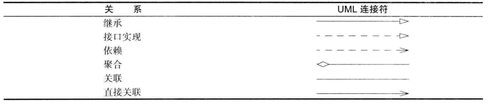

# 对象与类

## 一、UML类图

1. 继承：描述父类与子类之间的关系，父类又称作基类或超类，子类又称作派生类
2. 接口实现：规定接口和实现接口的关系。
3. 依赖：某个类的方法使用另一个类的对象作为参数。
4. 聚合：一个类的对象作为另一个类的属性（强调整体与部分）。是关联关系的一种，强的关联关系。
5. 关联：一个类的对象作为另一个类的属性。
6. 直接关联：单向关联。

## 二、零碎知识点

- Java的对象变量与C++中的指针类似。所有Java对象都存在堆中。当一个对象包含另一个对象变量时，这个变量依然包含着指向另一个堆对象的指针

  ```java
  Date date;
  //等同于
  Date* date;
  ```

  