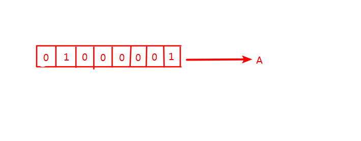
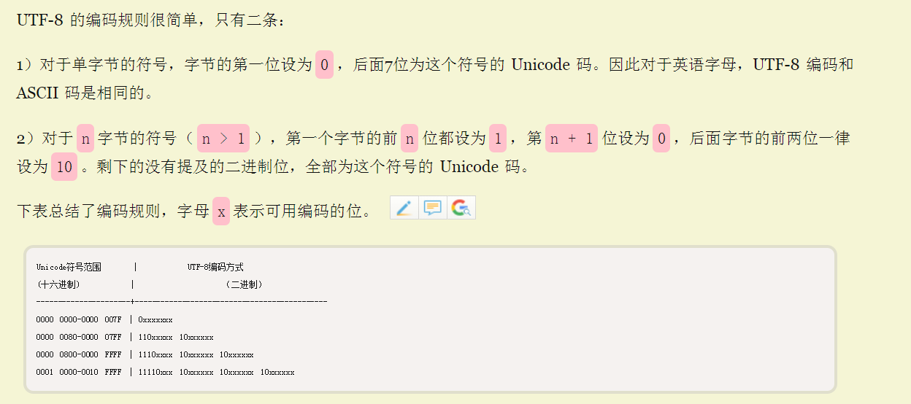
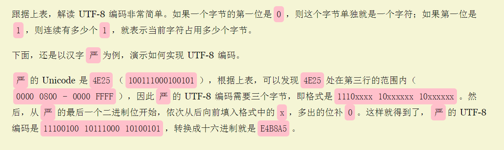
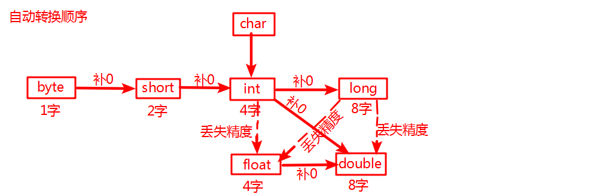

# 数据类型

## 一、基本数据类型

| 类型             | 八种基本数据类型                |
| ---------------- | ------------------------------- |
| 四种整形         | int(4个字节)、short、long、byte |
| 两种浮点型       | float(4个字节)、double(8个字节) |
| 一种字符串型     | char(2个字节)                   |
| 一种表示真值类型 | boolean                         |

- float类型后缀有个f（3.14f）,没有后缀如（3.14）默认为double类型

  ```java
  float b = 2.15;//报错
  ```

- 判断是否为Double.NaN

  ```java
  Double.isNaN()
  ```

- 浮点数无法精确的表示1/10

  ```java
  float a = 3.2f;
  float b = 3.3f;
  System.out.println(b-a);//0.099999905
  ```

- char类型占2个字节（16位）

## 二、编码

### 2.1ASCII码

- 60年代美国指定的一套编码有2^7（第一个统一为0）个字符



### 2.2UTF-8

- UTF-8 就是在互联网上使用最广的一种 Unicode 的**实现方式**

- UTF-8 最大的一个特点，就是它是一种**变长**的编码方式。它可以使用1~4个字节表示一个符号，根据不同的符号而**变化字节长度**。 

- 

  

  

## 三、数值转换



- ```java
  x += 3.5//合法，会发生强制类型转换，将把x设置为（int）(x + 3.5)
  ```

  

