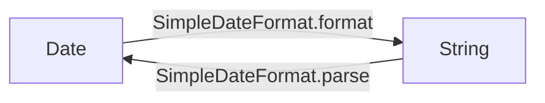

# 日期

## 一、原日期处理类

- 日期可变


## 1.1Date

```java
public class DateExp {
    /**
     * Date 的俩个构造方法
     */
    @Test
    public void constract(){
        //无参构造
        Date date1 = new Date();
        System.out.println(date1.toString());

        //long参数
        long time = 10000L;
        Date date2 = new Date(time);
        System.out.println(date2.toString());

    }

    @Test
    /**
     *  几个日期比较的方法
     */
    public void compareMethod(){
        Date date = new Date();
        long time = 10000L;
        Date date2 = new Date(time);

        //after,before
        System.out.println(date.after(date2));
        System.out.println(date.before(date2));

        //compateTo
        System.out.println(date.compareTo(date2));

        //equals
        System.out.println(date.equals(date2));
    }

    @Test
    /**
     * Date中时间相关
     */
    public void getTime(){
        //得到精确毫秒数
        Date date = new Date();
        System.out.println(date.getTime());

        //设置毫秒数
        Date before = new Date();
        System.out.println("before" + before);
        before.setTime(10000L);
        System.out.println("after" + before);

    }

}

```

## 1.2SimpleDateFormat(日期的格式化)

```java
public class SimpleDateFormatExp {
    @Test
    /**
     * 日期的格式化
     */
    public void simpleDateFormatTest(){
        Date date = new Date();
        SimpleDateFormat sdf = new SimpleDateFormat("yyyy-MM-dd HH:mm:ss");
        String time = sdf.format(date);
        System.out.println(time);
    }
}
```

## 1.3Date 和 String  的相互转化




- 口诀：日期格式化成字符串

  ​			字符串解析成日期

```java
@Test
/**
 * String --> Date
 */
public void stringToDate() throws ParseException {
    String s = "2019-09-08 10:10:10";
    SimpleDateFormat sdf = new SimpleDateFormat("yyyy-MM-dd HH:mm:ss");
    Date date;
    date = sdf.parse(s);
    System.out.println(sdf.format(date));
}

@Test
/**
 * Date --> String
 */
public void dateToString() throws ParseException {
    Date date = new Date();
    SimpleDateFormat sdf = new SimpleDateFormat("yyyy-MM-dd HH:mm:ss");
    String dateString = sdf.format(date);
    System.out.println(dateString);
}
```


## 二、1.8日期处理类

### 2.1 java.time包

- 不可变


### 2.2 JDBC


https://www.jianshu.com/p/19bd58b30660

## 三、joda-time

