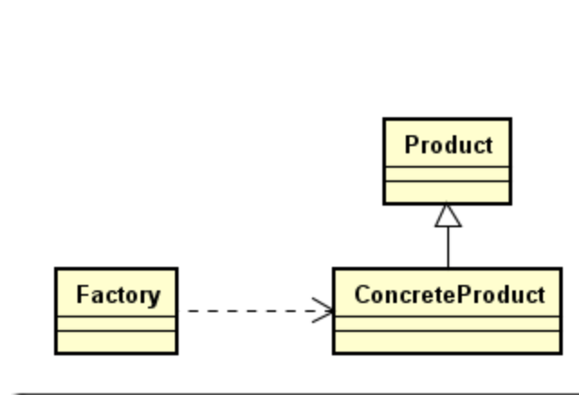
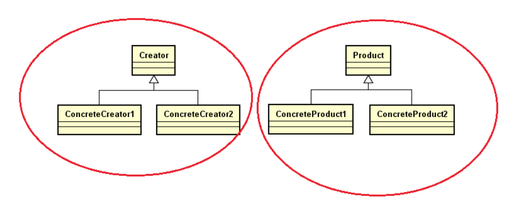
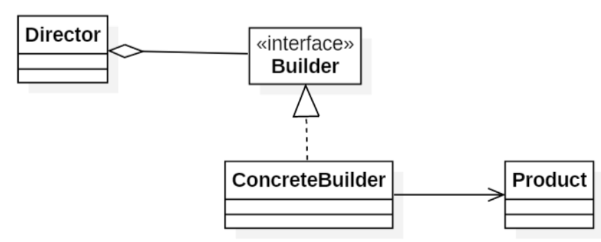

### 一、简单工厂

- 有一个类，他有个静态方法，可以根据不同的条件判断需要创建的对象类型
- 是一个工厂类包打天下，创建所有的产品

### 二、工厂方法模式

- 核心的工厂角色，不再是具体的工厂，也就是不再负责所有具体产品的创建，进一步转变为抽象角色。

- 从一个类包打天下（简单工厂模式），转换为兄弟姐妹一起上（工厂方法）

- 将简单工厂的多个if else换成了不同的具体工厂

  

### 三、单例模式

- 作用：是一个类只有一个实例。
- 如何实现？构造函数私有，这个类自己维护自己单实例，提供访问实例的方法。
- 方式：饿汉、懒汉。各自优缺点？
- 线程是否安全，懒汉模式如何使线程安全，双重检测连个if判断的作用，Sychonized作用，Volatile作用

### 四、建造者模式

- 作用：将零件的生产和组装进行了分离，Builder负责生产零件，Director负责组装

