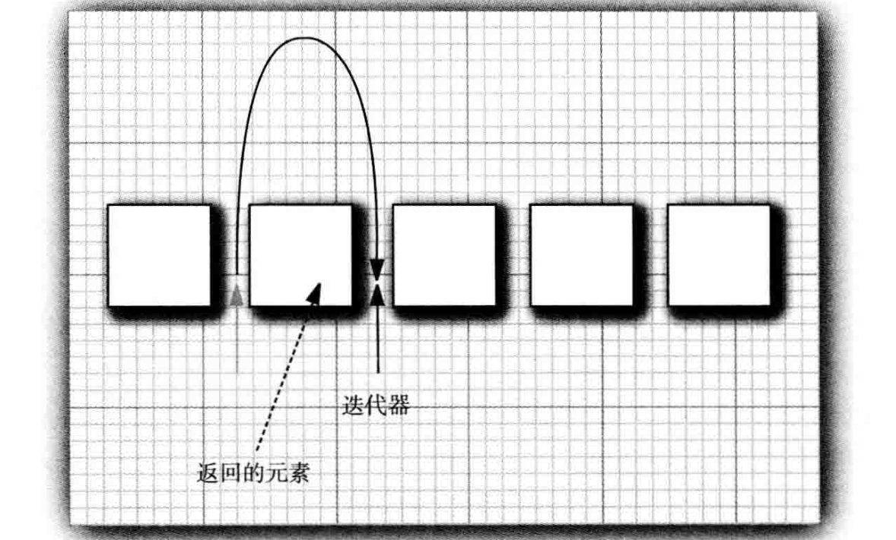
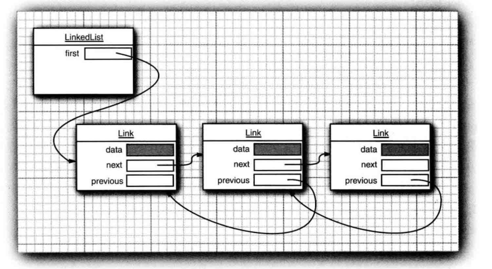
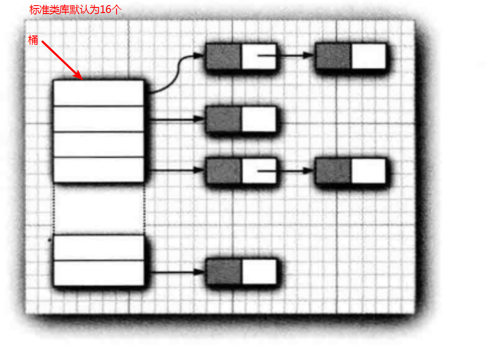
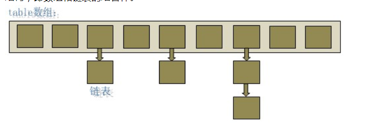
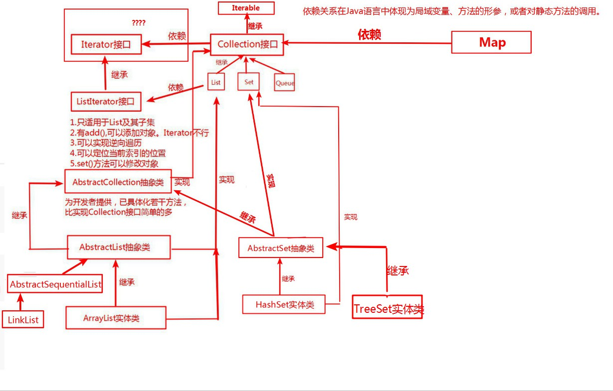

# 集合Collection

## 一、集合简介

### 1.1简介集合表示一组对象，它把一些对象 收集起来

- 位于java.util包下
- 长度可变，只能存放对象 ,如果要存放基本数据类型，应使用包装类
- ~~<u>对象不能重复？</u>~~
- 散列集不可重复

### 1.2基本方法

```java
public interface Collection<E>{
    boolean add(E element);
    Interator<E> iterator();
    ....
}
```

## 二、迭代器

### 2.1基本方法

```java
public interface Interator<E>{
    E next();
    boolean hasNext();
    void remove();
    default void forEachRemaining(Consumer<? super E> action);
}

public interface ListInterator<E> extends Interator<E>{
    ...
    void add(E element);
    E previous();
    boolean hasPrevious();
    ...
}
```

- Collection接口扩展了Iterable接口，因此任何集合都可以使用“forEach”循环，在javase 8中可以用lambda表达式

  `iterator.forEachRemaining(element->do something with element)`

- 其子接口ListInterator有add()方法,而interator没有，因为只有对自然有序的集合使用迭代器添加元素才有意义。add方法不返回boolean类型，假定操作总会改变表
- remove()方法不能连续调用两次
- next()方法和previous()都返回越过的对象
- 


## 三、具体结合

### 3.1有序列表List

- 所有List实现类都可以通过它的迭代器（ListIterator）进行正向和反向的遍历

#### 3.11LinkList

- java中的所有链表都是双向链表
- LinkList查询慢删除增加操作快
- LinkList的add方法
- 多次调用ListIterator的add()方法，元素将依次添加到迭代器当前位置之前
- 调用迭代器的remove方法时将删除掠过的元素
- 迭代器的set()方法将替换掠过的元素

#### 3.12ArrayList

- 底层由数组实现

### 3.2集Set

- Set接口等同于Collection接口，不过其方法有更严谨的定义

#### 3.21散列集(HashSet)

- <u>简化版的HashMap,所有value都是同一个Object</u>
- <u>基于HashTable</u>

- 无序

- 不可重复

- 如果不知道元素的位置并且不在意元素的位置，可以用散列表(HashTable)快速查找元素

- 散列表为每个元素计算一个整数称为散列码，它由String类的hashCode()方法产生

- 散列表用链表数组实现(对象的散列码与桶的总数求余)

        

- 装填因子：如果装填因子为0.75，而表中超过75%的位置已经填入元素，这个表就会用双倍的桶树自动的进行散列

#### 3.22树集(TreeSet)

- 有序

- 不可重复

- 存取速度比HashSet慢，查找速度比HashSet快

- 底层由红黑树实现

- 作用：可以在存的过程当中为对象排序。存取对象要实现Comparable接口。

  ```java
  public int compareTo(Person o) {
      return 0;                //当compareTo方法返回0的时候集合中只有一个元素
      return 1;                //当compareTo方法返回正数的时候集合会怎么存就怎么取
      return -1;               //当compareTo方法返回负数的时候集合会倒序存储
  }
  ```

  

### 3.3队列Queue

### 3.4映射Map

- 如果映射中没有与给定键对应的信息，get将返回null
- 如果对同一个键两次调用put方法，第二个会取代第一个值。put()将返回用这个键参数存储的上一个值

#### 3.41HashMap



- 线程不安全
- 初始size为16，扩容：newsize = oldsize*2，size一定为2的n次幂

#### 3.42HashTable

- 线程安全,在操作修改数据时会锁住整个HashTable
- key和value都不能为null

## 附录

